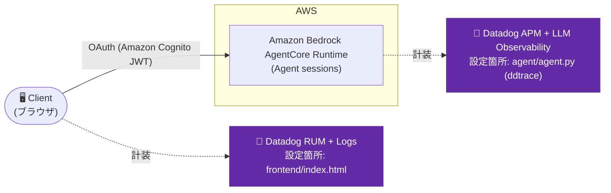
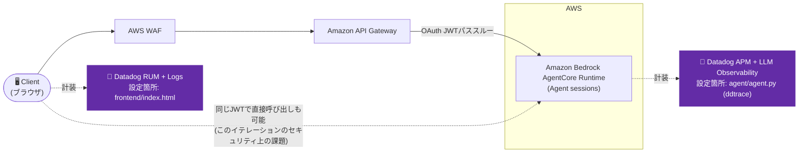
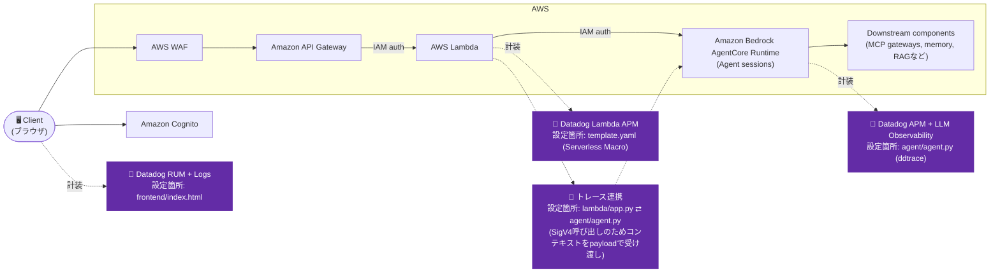
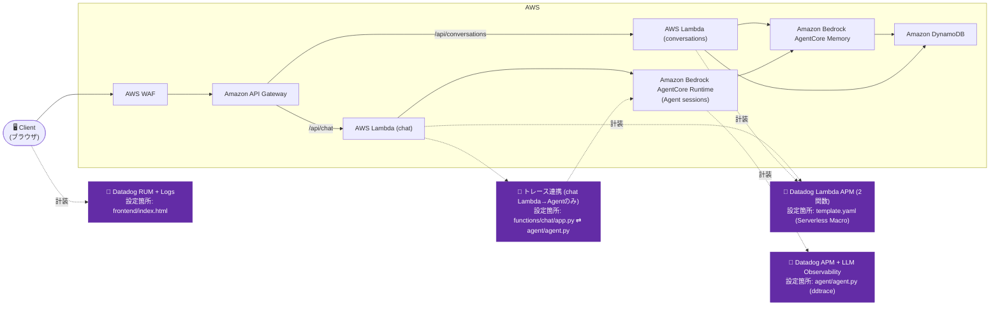

## 概要

このリポジトリは、Amazon Bedrock AgentCore Runtimeを使ってAWS上にAIエージェントをデプロイするための、複数のアーキテクチャパターンを収録しています。各イテレーションは前のイテレーションを土台に、シンプルな構成から本番運用向けの構成へと段階的に発展させています。

含まれるエージェントはすべてLangGraphを使ったシンプルなプロトタイプですが、様々な用途に拡張可能です。本リポジトリの主眼はエージェント自体の機能ではなく、それを取り囲むアーキテクチャ構成要素です。

> **これはフォークです**。元は [aws-samples/sample-ai-agent-architectures-agentcore](https://github.com/aws-samples/sample-ai-agent-architectures-agentcore) で、各AWSアーキテクチャパターンの上に **Datadogによるオブザーバビリティ**(RUM、APM、LLM/Agent Observability)を追加しています。追加した内容と既知の問題については、下記の [Datadog Observability](#datadog-observability-this-fork) を参照してください。

## <a id="datadog-observability-this-fork"></a>Datadog設定(このフォークでの追加)

各イテレーションは、AWSアーキテクチャに加えてDatadog向けの計装がされています。パターンはイテレーションごとに共通です: まずアプリを動かし、その後にDatadogを重ねて追加します(フロントエンドのRUM、エージェント側のAPM/LLM Observability、Lambdaが存在する場合はLambdaのAPM)。

- **RUM + Logs** — 各イテレーションの `frontend/index.html` に、Datadog Browser SDKで追加。イテレーション/環境ごとにDatadog RUM Application(`applicationId` + `clientToken`)が必要です。
- **APM + LLM/Agent Observability(AgentCoreエージェント側)** — 各 `agent/agent.py` の最初のimportとして `ddtrace` + `ddtrace.llmobs.LLMObs.enable(agentless_enabled=True)` を追加。設定は(どのファイルにも保存せず)`agentcore deploy --env KEY=VALUE` で渡す環境変数経由: `DD_API_KEY`、`DD_SITE`、`DD_LLMOBS_ML_APP_NAME`、`DD_ENV`、`DD_SERVICE`、`DD_TRACE_LANGCHAIN_ENABLED=false`。
- **Lambda APM(iteration-2、iteration-3)** — Datadog Lambda layer/extensionを手動で組み込む代わりに、各 `template.yaml` の `Transform` セクションに [Datadog Serverless Macro](https://docs.datadoghq.com/serverless/libraries_integrations/macro/) を追加して計装。
- **Lambda → AgentCore境界を越えたトレース連携** — `invoke_agent_runtime` はHTTPではなくSigV4署名付きのAWS SDK呼び出しのため、Datadogはトレースコンテキストを自動伝播できません。`iteration-2/lambda/app.py` と `iteration-2/agent/agent.py` は、JSONペイロード経由でトレースコンテキストを手動でinject/extractし、エージェント側はLangGraphエージェントを呼び出す前に本物の子スパン(`tracer.start_span(child_of=..., activate=True)`)を開きます — 単なる `tracer.context_provider.activate()` では*不十分*です。LangGraphのPregelランタイムは `concurrent.futures.ThreadPoolExecutor` でノードを実行し、ddtraceのスレッド間伝播はアクティブなSpanしか運ばず、スパンを持たないremote Contextは運ばないためです。

### <a id="datadog-setup-steps"></a>Datadogセットアップ手順

これは、あるイテレーションのAWS側がデプロイ済みで動作していることを確認した**後**に行ってください([はじめに](#getting-started)とそのイテレーション自身のREADMEを参照)。イテレーションごとに繰り返します — 以下の `<N>` はイテレーション番号(`0`、`1`、`2`、...)です。

**0. 前提条件**

```bash
export DD_API_KEY=<あなたのDatadog APIキー>
export DD_APP_KEY=<あなたのDatadog Applicationキー>
export DD_SITE=datadoghq.com   # または自分の組織のsite、例: us5.datadoghq.com
```

**1. RUM + Logs(フロントエンド)**

RUM Browser Applicationを作成します(専用CLIはないため、APIを直接使用):

```bash
curl -s -X POST "https://api.${DD_SITE}/api/v2/rum/applications" \
  -H "DD-API-KEY: ${DD_API_KEY}" \
  -H "DD-APPLICATION-KEY: ${DD_APP_KEY}" \
  -H "Content-Type: application/json" \
  -d '{
    "data": {
      "type": "rum_application_create",
      "attributes": { "name": "agentcore-sample-iteration-<N>", "type": "browser" }
    }
  }'
```

レスポンスから `applicationId` と `clientToken` を取得し、`iteration-<N>/frontend/index.html` の `<head>` の一番先頭(他の `<script>` タグより前)に追加します:

```html
<script>
  (function(h,o,u,n,d) {
    h=h[d]=h[d]||{q:[],onReady:function(c){h.q.push(c)}}
    d=o.createElement(u);d.async=1;d.src=n
    n=o.getElementsByTagName(u)[0];n.parentNode.insertBefore(d,n)
  })(window,document,'script','https://www.datadoghq-browser-agent.com/us1/v6/datadog-rum.js','DD_RUM')

  window.DD_RUM.onReady(function() {
    window.DD_RUM && window.DD_RUM.init({
      applicationId: '<RUM_APPLICATION_ID>',
      clientToken: '<RUM_CLIENT_TOKEN>',
      site: '<DD_SITE>',
      service: 'agentcore-iteration-<N>-frontend',
      env: 'sandbox',
      version: '1.0.0',
      sessionSampleRate: 100,
      sessionReplaySampleRate: 20,
      trackUserInteractions: true,
      trackResources: true,
      trackLongTasks: true,
    });
  });
</script>
<script>
  (function(h,o,u,n,d) {
    h=h[d]=h[d]||{q:[],onReady:function(c){h.q.push(c)}}
    d=o.createElement(u);d.async=1;d.src=n
    n=o.getElementsByTagName(u)[0];n.parentNode.insertBefore(d,n)
  })(window,document,'script','https://www.datadoghq-browser-agent.com/us1/v6/datadog-logs.js','DD_LOGS')
  window.DD_LOGS.onReady(function() {
    window.DD_LOGS.init({
      clientToken: '<RUM_CLIENT_TOKEN>',
      site: '<DD_SITE>',
      forwardErrorsToLogs: true,
    })
  })
</script>
```

**2. APM + LLM/Agent Observability(AgentCoreエージェント側)**

`iteration-<N>/agent/requirements.txt` に `ddtrace` を追加し、`iteration-<N>/agent/agent.py` では `LLMObs.enable(...)` を、他のどのimportよりも前に、一番最初に実行されるようにします:

```python
import os

from ddtrace.llmobs import LLMObs

LLMObs.enable(
    ml_app=os.environ.get("DD_LLMOBS_ML_APP_NAME", "agentcore-iteration-<N>-agent"),
    api_key=os.environ.get("DD_API_KEY"),
    site=os.environ.get("DD_SITE", "datadoghq.com"),
    agentless_enabled=True,
)

# ... 元のimport(json、bedrock_agentcore、langgraphなど)はこの後に続く
```

エージェントのvenvで依存関係を再インストールし、Datadog用の環境変数付きでエージェントを再デプロイします(`agentcore deploy` はこれらをRuntimeリソースに直接保持します — どのファイルにも書き込まれません):

```bash
cd iteration-<N>/agent
source .venv/bin/activate && uv pip install -r requirements.txt

AGENTCORE_SUPPRESS_RECOMMENDATION=1 agentcore deploy \
  --env "DD_API_KEY=${DD_API_KEY}" \
  --env "DD_SITE=${DD_SITE}" \
  --env "DD_LLMOBS_ML_APP_NAME=agentcore-iteration-<N>-agent" \
  --env "DD_ENV=sandbox" \
  --env "DD_SERVICE=agentcore-iteration-<N>-agent" \
  --env "DD_TRACE_LANGCHAIN_ENABLED=false"
```

`DD_TRACE_LANGCHAIN_ENABLED=false` は**必須**でオプションではありません — 詳細は下記の[既知の問題・落とし穴](#known-issues--gotchas)を参照してください。

**3. Lambda APM(iteration-2、iteration-3のみ)**

[Datadog Serverless Macro](https://docs.datadoghq.com/serverless/libraries_integrations/macro/) をAWSアカウント/リージョンごとに一度だけインストールする必要があります:

```bash
aws cloudformation create-stack \
  --stack-name datadog-serverless-macro \
  --template-url https://datadog-cloudformation-template.s3.amazonaws.com/aws/serverless-macro/latest.yml \
  --capabilities CAPABILITY_AUTO_EXPAND CAPABILITY_IAM
```

その上で、`iteration-<N>/template.yaml` の `Transform` を単一文字列からリストに拡張し、`DatadogApiKey` パラメータ(`NoEcho: true` — 値はデプロイ時に渡すだけで、ハードコードしません)を追加します:

```yaml
Transform:
  - AWS::Serverless-2016-10-31
  - Name: DatadogServerless
    Parameters:
      stackName: !Ref "AWS::StackName"
      apiKey: !Ref DatadogApiKey
      pythonLayerVersion: "<最新のPython Layerバージョン>"      # 確認方法: curl -s https://api.github.com/repos/DataDog/datadog-lambda-python/releases/latest
      extensionLayerVersion: "<最新のExtension Layerバージョン>" # 確認方法: curl -s https://api.github.com/repos/DataDog/datadog-lambda-extension/releases/latest
      service: agentcore-iteration-<N>-chat
      env: sandbox
      site: datadoghq.com

Parameters:
  # ... 既存のパラメータ ...
  DatadogApiKey:
    Type: String
    NoEcho: true
```

このMacroは、計装対象の各関数の `FunctionName` が(`!Sub`などの組み込み式ではなく)**リテラル文字列**であることを要求します(ログサブスクリプションを設定する際に具体的な名前が必要なため)。

> **1つのテンプレートに複数関数がある場合の落とし穴(iteration-3)**: 各 `AWS::Serverless::Function` リソースに `Metadata: {DatadogServerless: {service: ...}}` で関数ごとのサービス名を設定しても、実際には `DD_SERVICE` は設定されませんでした(`aws lambda get-function-configuration` で確認 — 単純に存在していなかった)。確実な回避策は、代わりに各関数の `Environment.Variables` に直接 `DD_SERVICE` を設定することです:
> ```yaml
>       Environment:
>         Variables:
>           DD_SERVICE: agentcore-iteration-<N>-chat   # 各関数に直接設定する。Metadata.serviceには依存しない
> ```

その上で、キーをパラメータとして渡してビルド・デプロイします:

```bash
cd iteration-<N>
sam build
sam deploy --parameter-overrides \
  "AgentCoreRuntimeArn=<あなたのエージェントARN>" \
  "CognitoUserPoolArn=<あなたのCognitoユーザープールARN>" \
  "DatadogApiKey=${DD_API_KEY}"
```

**4. Lambda → AgentCore呼び出しを越えたトレース連携(iteration-2、iteration-3)**

`invoke_agent_runtime` はHTTPではなく、IAMのSigV4署名付きAWS SDK呼び出しのため、実際のHTTPホップの場合のようにDatadogが自動でトレースコンテキストを伝播することはできません。Lambdaのトレースとエージェント側のLLM呼び出しスパンを1つのトレースとして繋げるため、トレースコンテキストをJSONペイロード経由で手動で運びます:

Lambda側(`lambda/app.py`)で、現在のトレースコンテキストをリクエストペイロードにinjectします:

```python
from ddtrace import tracer
from ddtrace.propagation.http import HTTPPropagator

dd_trace_headers = {}
HTTPPropagator.inject(tracer.current_trace_context(), dd_trace_headers)

response = client.invoke_agent_runtime(
    agentRuntimeArn=AGENTCORE_RUNTIME_ARN,
    qualifier="DEFAULT",
    payload=json.dumps({"prompt": message, "_datadog_trace_headers": dd_trace_headers})
)
```

エージェント側(`agent/agent.py`)では、それをextractし、LangGraphエージェントを呼び出す前に**本物の子スパン**を開きます — extractしたコンテキストに対して単に `tracer.context_provider.activate(...)` するだけでは*不十分*です(下記の落とし穴を参照):

```python
import contextlib

from ddtrace import tracer
from ddtrace.propagation.http import HTTPPropagator

dd_trace_headers = payload.get("_datadog_trace_headers") if payload else None
dd_context = HTTPPropagator.extract(dd_trace_headers) if dd_trace_headers else None

# Spanはコンテキストマネージャプロトコルを実装している(exit時に自動でfinishする)ため、
# 受信したトレースコンテキストがない場合はif/elseでinvoke()呼び出しを重複させる代わりに
# nullcontext()を使う。
span_ctx = (
    tracer.start_span("agentcore.invoke", child_of=dd_context, service=os.environ.get("DD_SERVICE"), activate=True)
    if dd_context and dd_context.trace_id
    else contextlib.nullcontext()
)
with span_ctx:
    result = get_agent().invoke({"messages": [("human", prompt)]})
```

### <a id="known-issues--gotchas"></a>既知の問題・落とし穴

- **LangGraph + ddtraceのクラッシュ**: LangGraphのツールを使うエージェントで `LLMObs.enable(...)` を有効にすると、ツールが実行された瞬間に(トレーシングだけでなく)実際のリクエストがクラッシュすることがあります。これはddtraceのバグ([dd-trace-py#18561](https://github.com/DataDog/dd-trace-py/issues/18561))が原因で、JSONシリアライズ不可能なオブジェクトがスパンのメタデータに漏れ込むためです。回避策: エージェントに `DD_TRACE_LANGCHAIN_ENABLED=false` を設定する(`DD_TRACE_LANGGRAPH_ENABLED` も一緒に無効化しては**いけません** — それもクラッシュを避けられますが、トレースのワークフロー構造が失われてしまいます)。
- **AgentCore自身のOTelベースのObservabilityとDatadogのddtraceは、互いに独立して並行動作します** — `agentcore deploy` はすべてのエージェントに対して、AWSネイティブなOTelパイプライン(X-Ray / CloudWatch GenAI Observability Dashboard)を自動で有効化します。ddtraceはこれを検知し、明示的にそれを使わない(代わりに自身のネイティブな計装にフォールバックする)ため、2つは別々の連携しないトレースを生成します。両方が実際にライブデータを受信していること(単に「設定されている」だけでないこと)を `aws xray get-trace-summaries`/`batch-get-traces` で確認済みです。
- **AgentCore CLIは`@aws/agentcore`への移行に伴い非推奨化されています**: 本リポジトリ(およびこのフォークの計装)は `bedrock-agentcore-starter-toolkit`(`pip install bedrock-agentcore`)を使用しており、コマンド実行ごとに非推奨の通知が表示されます。`AGENTCORE_SUPPRESS_RECOMMENDATION=1` を設定すると抑制できます。

## このリポジトリの使い方

このリポジトリは、最もシンプル(だが最も安全性が低い)なパターンから始めて、セキュリティと機能のレイヤーを段階的に追加していく順番で読み進めることを想定しています。

**推奨の進め方:**

1. **Iteration 0から始めて**、Amazon Bedrock AgentCoreとAmazon Cognito OAuth認証の基本を理解します。エージェントを最速で動かせる方法ですが、エージェントがブラウザに直接露出します。



2. **Iteration 1に進み**、エージェントの前段にAmazon API Gatewayを追加します。AWS WAFによるレート制限が加わりますが、セキュリティ上のギャップが残ります: ユーザーが取得するJWTはAPIとエージェントの両方に対して直接使えてしまいます。



3. **Iteration 2に進み**、IAM認証に切り替えることでこのセキュリティ上のギャップを修正します。ユーザーはAmazon Cognitoを使ってAmazon API Gatewayに認証しますが、AWS LambdaはIAMクレデンシャルを使ってエージェントを呼び出します。ユーザーはAPIを迂回できなくなります。



4. **Iteration 3で仕上げ**、Amazon Bedrock AgentCore MemoryとAmazon DynamoDBを使って会話の永続化を追加し、フル機能のチャット体験にします。



トレードオフをすでに理解している場合は、任意のイテレーションに直接進んでも構いません。あるいは特定のイテレーションを自分のプロジェクトの出発点として使うこともできます。

> **注記**: Iteration 0でデプロイするAmazon Cognitoスタックは全イテレーションで共有されるため、デプロイは一度だけで済みます。

## イテレーション一覧

### Iteration 0: ブラウザから直接Amazon Bedrock AgentCoreへ

**適した用途**: 素早いプロトタイピングと基本の理解。

```
Browser → Amazon Bedrock AgentCore Runtime (Amazon CognitoによるOAuth)
```

- 最もシンプルな構成
- ブラウザがAmazon Bedrock AgentCoreを直接呼び出す
- 認証はAmazon Cognito OAuth
- **Datadog設定**: フロントエンドにRUM+Logs、エージェントにAPM + LLM Observability

[Iteration 0を見る →](./iteration-0/)

### Iteration 1: Amazon API Gateway + Amazon Bedrock AgentCore

**適した用途**: 独自のコンピュートを追加せずにAPI管理を追加したい場合。

```
Browser → Amazon API Gateway → Amazon Bedrock AgentCore Runtime (OAuth)
              (Amazon Cognito)
```

- Amazon API Gatewayがレート制限・リクエスト検証を担当
- Amazon API Gatewayに Amazon Cognito authorizer を設定
- OAuth JWTをAmazon Bedrock AgentCoreへパススルー
- **セキュリティ上の注記**: ユーザーのJWTがAPIとエージェントの両方に使えてしまう — 本番環境には不向き
- **Datadog設定**: フロントエンドにRUM+Logs、エージェントにAPM + LLM Observability

[Iteration 1を見る →](./iteration-1/)

### Iteration 2: Amazon API Gateway + AWS Lambda + Amazon Bedrock AgentCore(IAM認証)

**適した用途**: 独自のコンピュート層を持つ、セキュアな本番構成。

```
Browser → Amazon API Gateway → AWS Lambda → Amazon Bedrock AgentCore Runtime (IAM認証)
              (Amazon Cognito)
```

- 独自のロジック・ログ出力・入力検証のためのAWS Lambda層
- エージェントはIAM認証を使用 — ユーザーはAPIを迂回してエージェントを直接呼び出せない
- Amazon Cognitoによる検証はAmazon API Gatewayレベルのみ
- Iteration 1のセキュリティ上のギャップを修正
- **Datadog設定**: フロントエンドにRUM+Logs、Datadog Serverless Macro経由のLambda APM、エージェントにAPM + LLM Observability、Lambda → AgentCore呼び出しを越えたトレース連携

[Iteration 2を見る →](./iteration-2/)

### Iteration 3: Amazon API Gateway + AWS Lambda + Amazon Bedrock AgentCore(Memory付き)

**適した用途**: 会話の永続化を備えた、フル機能のチャット体験。

```
Browser → Amazon API Gateway → AWS Lambda (Chat) → Amazon Bedrock AgentCore Runtime + Memory
                            → AWS Lambda (Conversations) → Amazon Bedrock AgentCore Memory + Amazon DynamoDB
```

- チャットと会話履歴でLambda関数を分離
- 会話の永続化にAmazon Bedrock AgentCore Memoryを使用
- 会話のメタデータ(名前)にAmazon DynamoDBを使用
- 会話名を自動生成
- **Datadog設定**: フロントエンドにRUM+Logs、両方のLambdaにDatadog Serverless Macro経由のLambda APM、エージェントにAPM + LLM Observability、chat Lambda → AgentCore呼び出しを越えたトレース連携(エージェントを呼ぶのは`chat` Lambdaのみ。`conversations`はAgentCore Memory/DynamoDBに直接アクセスするため連携は不要)

[Iteration 3を見る →](./iteration-3/)

### Iteration 1(OTelバリアント): OpenTelemetry経由でAWS CloudWatch/X-Rayと*同時に*Datadogへも送信

**適した用途**: 「Datadogネイティブのトレーサーの代わりにOTelでAWSとDatadogの両方にテレメトリを送れるか?」という問いに答える。

iteration-1のコピー(デプロイ済みエージェントには影響しません)を使い、AgentCore自身のOTelベースのObservabilityパイプラインをDatadogへの送信にも拡張できるかを調査したものです。結論を先に言うと、拡張できる既存のin-processパイプラインは存在しません(実証的に確認済み — in-processの`TracerProvider`もローカルOTLPコレクタも存在しない)が、アプリ自身がOpenTelemetry SDKのセットアップを持ち、コレクタを介さない独立した2つの直接OTLPエンドポイント(AWS X-RayとDatadog)へfan-outすることで、実際のdual-shipは可能です。詳しい調査内容・動作するコードパターン・落とし穴は、そのフォルダのREADMEを参照してください。

[Iteration 1(OTelバリアント)を見る →](./iteration-1-otel/)

### Iteration 1(検証用バリアント): `agent.py`を変更せずにDatadog ddtrace/LLM Observabilityを有効化する2つの方式

**適した用途**: 「`LLMObs.enable(...)`をコードに書く代わりに、設定・環境変数だけでDatadogを有効化できないか?」という問いに答える。

iteration-1のコピーを2つ使い、`agent.py`に一切`ddtrace`/`LLMObs`関連のコードを書かずにDatadog APM + LLM Observabilityを有効化できるかを検証したものです。デプロイ方式(`deployment_type`)によって成立する方法が異なることを確認しています:

- **`iteration-1-llmobs-env/`**(`deployment_type: direct_code_deploy`。iteration-0/1/2/3が実際に使っている方式): `sitecustomize.py`(1行: `import ddtrace.auto`)を`agent.py`の隣に置き、`PYTHONPATH=.`を環境変数として渡す方式で動作確認済み。
- **`iteration-1-container-ddtrace-run/`**(`deployment_type: container`): デプロイ用`Dockerfile`の`CMD`に`ddtrace-run`を前置する方式で動作確認済み(ただしDockerfileが存在するcontainerデプロイでしか使えない)。

どちらも実際にデプロイし、CloudWatchログとDatadog APMの両方でエンドツーエンドの動作を確認済みです。詳細は各フォルダのREADMEを参照してください。

[Iteration 1(sitecustomize方式)を見る →](./iteration-1-llmobs-env/) / [Iteration 1(Dockerfile方式)を見る →](./iteration-1-container-ddtrace-run/)

## 前提条件

- AWS CLIがクレデンシャル付きで設定済み(`aws configure`)
- AWS SAM CLIがインストール済み([インストールガイド](https://docs.aws.amazon.com/serverless-application-model/latest/developerguide/install-sam-cli.html))
- Python 3.11以上(`python3 --version` で確認。システムのデフォルトがそれより古い場合は `uv python install 3.11` を使用)
- AgentCore CLI(`pip install bedrock-agentcore-starter-toolkit`)
- デプロイ先リージョンのAWSアカウントでBedrockモデルアクセス(Claudeモデル)が有効になっていること
- `DD_API_KEY` / `DD_APP_KEY` が使えるDatadogアカウント(Application Keysページ: `https://<your-org>.datadoghq.com/organization-settings/application-keys`) — 各イテレーションのDatadog Observabilityの手順で必要

> **Tip**: 開始前に `aws sts get-caller-identity` を実行して、AWSクレデンシャルが有効か確認してください。

## <a id="getting-started"></a>はじめに

**Iteration 0から始めてください** — 全イテレーションで共有されるCognitoスタックが含まれています:

```bash
cd iteration-0

# Cognitoをデプロイ(全イテレーションで使用)
aws cloudformation deploy \
  --template-file cognito.yaml \
  --stack-name agentcore-cognito \
  --capabilities CAPABILITY_NAMED_IAM \
  --region us-east-1
```

> **注記**: 次に進む前に、スタックの完了を待ってください。状態は以下で確認できます:
> ```bash
> aws cloudformation describe-stacks --stack-name agentcore-cognito --query 'Stacks[0].StackStatus'
> ```

```bash
# テストユーザーを作成
USER_POOL_ID=$(aws cloudformation describe-stacks \
  --stack-name agentcore-cognito \
  --query 'Stacks[0].Outputs[?OutputKey==`UserPoolId`].OutputValue' \
  --output text)

aws cognito-idp admin-create-user \
  --user-pool-id $USER_POOL_ID \
  --username <YOUR_USERNAME_HERE> \
  --temporary-password <YOUR_PASSWORD_HERE> \
  --message-action SUPPRESS

aws cognito-idp admin-set-user-password \
  --user-pool-id $USER_POOL_ID \
  --username <YOUR_USERNAME_HERE> \
  --password <YOUR_PASSWORD_HERE> \
  --permanent
```

> **パスワード要件**: 8文字以上で、大文字・小文字・数字・特殊文字を含む必要があります

> **ユーザー名の要件**: このCognitoユーザープールは `<YOUR_USERNAME_HERE>` が有効な**メールアドレス形式**であることを要求します(例: `test-user@example.com`) — `test-user` のような単純なユーザー名は `Username should be an email` として拒否されます。実際に到達可能なアドレスである必要はありません。

その後は各イテレーションフォルダのREADMEに従ってください。

## リポジトリ構成

```
.
├── iteration-0/                        # ブラウザから直接Amazon Bedrock AgentCoreへ
├── iteration-1/                        # Amazon API Gateway + Amazon Bedrock AgentCore (OAuth)
├── iteration-1-otel/                   # iteration-1のバリアント: OTel経由でAWS X-Rayと同時にDatadogへdual-ship
├── iteration-1-llmobs-env/             # iteration-1のバリアント: sitecustomize.py方式でagent.py無変更のDatadog有効化
├── iteration-1-container-ddtrace-run/  # iteration-1のバリアント: DockerfileのCMD編集方式でagent.py無変更のDatadog有効化
├── iteration-2/                        # Amazon API Gateway + AWS Lambda + Amazon Bedrock AgentCore (IAM)
└── iteration-3/                        # AWS Lambda + Amazon Bedrock AgentCore with Memory
```

## セキュリティ
詳細はCONTRIBUTINGを参照してください。

## ライセンス
このライブラリはMIT-0 Licenseの下でライセンスされています。LICENSEファイルを参照してください。
