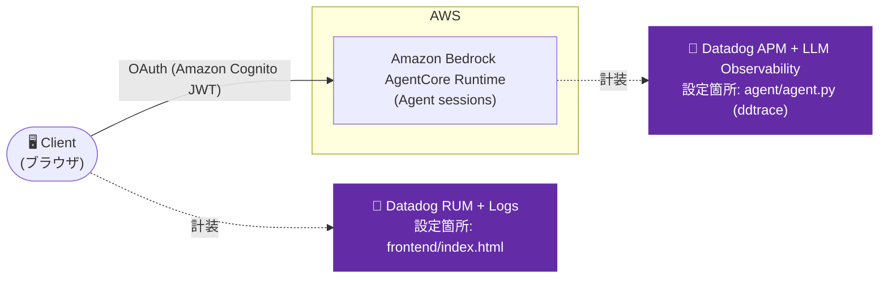

# Iteration 0: ブラウザから直接 → Amazon Bedrock AgentCore RuntimeでホストされるLangGraphエージェント + Amazon Cognitoを使ったOAuth認証

静的HTMLページからAmazon Cognito OAuthで認証し、Amazon Bedrock AgentCore Runtime上のLangGraphエージェントを直接呼び出す、最もシンプルな構成。

## Overview

- 実証するDatadog機能: RUM + Logs(フロントエンド)、APM + LLM/Agent Observability(エージェント)
- 技術スタック: Amazon Bedrock AgentCore Runtime上のLangGraphエージェント(Python)、Amazon Cognito(OAuth)、静的HTMLフロントエンド

このパターンは本番運用では崩れます。Web向けAIエージェントとして本番レベルで考慮すべき事項をカバーしていません。以降のイテレーションでは、この「クライアントからエージェントへ直結」パターンのギャップを修正していきます。

## Architecture



## Datadog設定

- 有効化している機能: RUM + Logs(フロントエンド)、APM + LLM/Agent Observability(エージェント)
- 関連ファイル:
  - `frontend/index.html` — Datadog Browser SDKのRUM/Logs初期化スニペット(`<head>`の先頭)
  - `agent/agent.py` — 最初のimportとして `ddtrace.llmobs.LLMObs.enable(...)` を呼び出し
- 必要な環境変数 / APIキー:
  ```bash
  export DD_API_KEY=<あなたのDatadog APIキー>
  export DD_APP_KEY=<あなたのDatadog Applicationキー>
  export DD_SITE=datadoghq.com
  ```
  エージェント側は `agentcore deploy` 実行時に以下の環境変数を渡します(ファイルには保存されません):
  ```bash
  agentcore deploy \
    --env "DD_API_KEY=${DD_API_KEY}" \
    --env "DD_SITE=datadoghq.com" \
    --env "DD_LLMOBS_ML_APP_NAME=agentcore-iteration-0-agent" \
    --env "DD_ENV=sandbox" \
    --env "DD_SERVICE=agentcore-iteration-0-agent" \
    --env "DD_TRACE_LANGCHAIN_ENABLED=false" \
    --env 'DD_TRACE_SAMPLING_RULES=[{"resource": "GET /ping", "sample_rate": 0}]'
  ```
  `DD_TRACE_LANGCHAIN_ENABLED=false` は必須です — ルートREADMEの「既知の問題・落とし穴」内の [dd-trace-py#18561](https://github.com/DataDog/dd-trace-py/issues/18561) を参照してください。`DD_TRACE_SAMPLING_RULES` はAgentCore自身の `GET /ping` ヘルスチェックのノイズをAPMから除外します。
- RUM appの作成手順や`agent.py`の正確なコードスニペットなど、汎用的な手順はルートの [README.md → Datadogセットアップ手順](../README.md#datadog-setup-steps) を参照してください。

## Prerequisites

- クレデンシャル付きで設定済みのAWS CLI(`aws configure`)
- インストール済みのAgentCore CLI(`pip install bedrock-agentcore`)
- `DD_API_KEY` / `DD_APP_KEY` が使えるDatadogアカウント

> **Tip**: `aws sts get-caller-identity` と `agentcore --version` でセットアップを確認してください

## Setup / How to Run

### 1. Amazon Cognitoをデプロイ(全イテレーションで共有)

このAmazon Cognitoスタックはすべてのイテレーションで使用されます。Amazon Bedrock AgentCore用のIAM実行ロールも作成します。一度だけデプロイしてください:

```bash
aws cloudformation deploy \
  --template-file cognito.yaml \
  --stack-name agentcore-cognito \
  --capabilities CAPABILITY_NAMED_IAM \
  --region us-east-1
```

出力値を取得します:
```bash
# User Pool ID
USER_POOL_ID=$(aws cloudformation describe-stacks \
  --stack-name agentcore-cognito \
  --query 'Stacks[0].Outputs[?OutputKey==`UserPoolId`].OutputValue' \
  --output text)

# Client ID
CLIENT_ID=$(aws cloudformation describe-stacks \
  --stack-name agentcore-cognito \
  --query 'Stacks[0].Outputs[?OutputKey==`UserPoolClientId`].OutputValue' \
  --output text)

# Cognito Domain
COGNITO_DOMAIN=$(aws cloudformation describe-stacks \
  --stack-name agentcore-cognito \
  --query 'Stacks[0].Outputs[?OutputKey==`CognitoDomain`].OutputValue' \
  --output text)

# Discovery URL (エージェントのOAuth設定用)
DISCOVERY_URL=$(aws cloudformation describe-stacks \
  --stack-name agentcore-cognito \
  --query 'Stacks[0].Outputs[?OutputKey==`OAuthDiscoveryUrl`].OutputValue' \
  --output text)

echo "User Pool ID: $USER_POOL_ID"
echo "Client ID: $CLIENT_ID"
echo "Cognito Domain: $COGNITO_DOMAIN"
echo "Discovery URL: $DISCOVERY_URL"
```

### 2. テストユーザーを作成

```bash
# ユーザーを作成
aws cognito-idp admin-create-user \
  --user-pool-id $USER_POOL_ID \
  --username <YOUR_USERNAME_HERE> \
  --temporary-password <YOUR_TEMP_PASSWORD_HERE> \
  --message-action SUPPRESS

# 永続パスワードを設定
aws cognito-idp admin-set-user-password \
  --user-pool-id $USER_POOL_ID \
  --username <YOUR_USERNAME_HERE> \
  --password <YOUR_PASSWORD_HERE> \
  --permanent
```

> **パスワード要件**: 8文字以上で、大文字・小文字・数字・特殊文字を含む必要があります

### 3. エージェントをデプロイ

```bash
cd agent
agentcore configure
```

設定時のプロンプトでは以下を入力します:
- **Entrypoint**: `agent.py`
- **Agent name**: `agent_0`(またはEnterでデフォルト)
- **Requirements file**: Enterで検出された`requirements.txt`を使用
- **Deployment type**: `1`(Direct Code Deploy)
- **Python runtime**: `2`(PYTHON_3_11)
- **Execution role**: Enterで自動作成
- **S3 bucket**: Enterで自動作成
- **Configure OAuth authorizer?**: `yes`
- **OAuth discovery URL**: 手順1の `$DISCOVERY_URL` を使用
- **Allowed OAuth client IDs**: 空欄(Enter)
- **Allowed OAuth audience**: 手順1の `$CLIENT_ID` を入力
- **Allowed OAuth scopes**: 空欄(Enter)
- **Custom claims**: 空欄(Enter)
- **Request header allowlist**: `no`
- **Memory**: `s`(スキップ)

続けてデプロイします:
```bash
agentcore deploy
```

出力からAgent ARNを控えておいてください — フロントエンドの設定で必要になります。

> **Tip**: Agent Runtime ARNをどこかに保存しておいてください — 例: `arn:aws:bedrock-agentcore:us-east-1:123456789012:runtime/agent_0-AbCdEf123`

### 4. フロントエンド設定を更新

`frontend/index.html` を編集し、CONFIGセクションを更新します:

```javascript
const CONFIG = {
  // CognitoドメインからはHttps://を除く
  cognitoDomain: 'apigw-agentcore-<YOUR_ACCOUNT_ID>.auth.<YOUR_REGION>.amazoncognito.com',
  clientId: '<YOUR_CLIENT_ID>',
  redirectUri: 'http://localhost:8000',
  agentRuntimeArn: 'arn:aws:bedrock-agentcore:<YOUR_REGION>:<YOUR_ACCOUNT_ID>:runtime/<YOUR_AGENT_RUNTIME_ID>'
};
```

> **重要**:
> - `cognitoDomain` に `https://` を含めないこと — ドメインのみ
> - `clientId` はCognitoスタックの出力値(手順1)から取得
> - `agentRuntimeArn` は `agentcore deploy` の出力にある完全なARN

### 5. フロントエンドを実行

```bash
cd frontend
python3 -m http.server 8000
```

http://localhost:8000 を開き、`<YOUR_USERNAME_HERE>` / `<YOUR_PASSWORD_HERE>` でログインします

**動作の流れ**:
1. ユーザーが「Login」をクリック → Amazon Cognito Hosted UIへリダイレクト
2. ログイン後、Amazon Cognitoが認可コード付きでリダイレクトして戻る
3. フロントエンドがコードをトークンに交換
4. フロントエンドがOAuthトークン付きでAmazon Bedrock AgentCore Runtimeを呼び出す
5. エージェントが応答

> **トラブルシューティング**:
> - **"Claim 'aud' value mismatch"**: フロントエンドCONFIGの `clientId` がエージェントの期待値と一致していません。手順1のCLIENT_IDを再確認してください。
> - **ログインはリダイレクトされるが何も起きない**: ブラウザのコンソールでエラーを確認してください。`redirectUri` が(末尾のスラッシュの有無を含め)完全に一致しているか確認してください。
> - **CORSエラー**: `127.0.0.1:8000` ではなく `http://localhost:8000` でアクセスしていることを確認してください。

## Verify in Datadog

- **RUM** — RUM Application `agentcore-sample-iteration-0` の Sessions/Session Replay 画面で、フロントエンドでのログイン〜チャット操作がセッションとして記録されていることを確認します。
- **APM + LLM Observability** — APM Trace Explorerで `service:agentcore-iteration-0-agent` を検索すると、`POST /invocations` のトレースと、その下にLangGraphのLLM呼び出しスパン(LLM Observability)が確認できます。

## Cleanup

```bash
# エージェントを削除
cd agent
agentcore destroy

# Amazon Cognitoを削除(他のイテレーションで使っていない場合のみ)
aws cloudformation delete-stack --stack-name agentcore-cognito
```

## Notes

構成要素:
- `cognito.yaml` - Amazon Cognito User PoolとIAMロール用のAWS CloudFormationテンプレート(全イテレーションで共有)
- `agent/` - シンプルなツールを持つLangGraphの hello world エージェント
- `frontend/index.html` - Amazon Cognito認証とチャットUIを持つ単一HTMLファイル

ファイル構成:
```
iteration-0/
├── README.md
├── cognito.yaml          # Amazon Cognito User Pool(全イテレーションで共有)
├── agent/
│   ├── agent.py          # LangGraphエージェント
│   └── requirements.txt
└── frontend/
    └── index.html        # Amazon Cognito認証付きの単一ページアプリ
```
