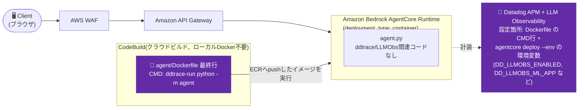

# Iteration 1 (container variant): Dockerfile の CMD に ddtrace-run を追記する方式

`deployment_type: container` のAgentCoreエージェントで、デプロイ用`Dockerfile`の`CMD`に`ddtrace-run`を前置することで、アプリコード変更なしにDatadog APM + LLM Observabilityを有効化できるかを検証したバリアント。

## Overview

- 実証するDatadog機能: APM + LLM/Agent Observability(アプリコード変更なし、`Dockerfile`のCMD編集+環境変数のみ)
- 技術スタック: Amazon Bedrock AgentCore Runtime(`deployment_type: container`)上のLangGraphエージェント(Python)、AWS CodeBuildによるクラウドビルド

これは [iteration-1](../iteration-1/) のコピーで、[`iteration-1-llmobs-env`](../iteration-1-llmobs-env/) で「機能しない」と判断した案 — **デプロイ用`Dockerfile`の`CMD`を編集して`ddtrace-run`を前置する**方式(`sitecustomize.py`/`PYTHONPATH`方式やアプリコード変更の代替案)— を、それが本来成立する構成で試すために作成した検証用ディレクトリです。

その案は `deployment_type: direct_code_deploy` には適用できません(そもそもDockerfileが存在しないため)。そこで、このディレクトリでは `deployment_type: container` を使い、編集対象のDockerfileが実際に存在する状態を作っています。専用のエージェント名(`agent_1_container_ddtrace_run`)を使用し、他のイテレーションのデプロイ済みエージェントには一切影響しません。

**結論**: **こちらも機能します。** すでに `container` デプロイを使っている場合は、`sitecustomize.py` 方式よりむしろシンプルとも言えます: `agent/agent.py` には `ddtrace`/`LLMObs` 関連のコードが一切なく、非標準な変更は `Dockerfile` の最終行1行だけです。

## Architecture



## Datadog設定

- 有効化している機能: APM + LLM/Agent Observability(エージェント側のみ。RUM/Lambdaはこの検証の対象外)
- 関連ファイル:
  - `agent/Dockerfile` — 最終行の`CMD`を `["ddtrace-run", "python", "-m", "agent"]` に変更(下記「仕組み」を参照)
  - `agent/agent.py` — 変更なし(素のエージェントコード)
- 必要な環境変数 / APIキー(`agentcore deploy`実行時):
  ```bash
  agentcore deploy \
    --env "DD_API_KEY=${DD_API_KEY}" \
    --env "DD_SITE=datadoghq.com" \
    --env "DD_ENV=sandbox" \
    --env "DD_SERVICE=agentcore-iteration-1-container-ddtrace-run-agent" \
    --env "DD_LLMOBS_ENABLED=1" \
    --env "DD_LLMOBS_ML_APP=agentcore-iteration-1-container-ddtrace-run-agent" \
    --env "DD_LLMOBS_AGENTLESS_ENABLED=1" \
    --env "DD_TRACE_LANGCHAIN_ENABLED=false" \
    --env 'DD_TRACE_SAMPLING_RULES=[{"resource": "GET /ping", "sample_rate": 0}]'
  ```
- 仕組み:
  1. `agentcore configure --deployment-type container ...` を実行すると、ツールキットのキャッシュディレクトリ(`.bedrock_agentcore/<agent_name>/Dockerfile`、gitignore対象)に、デフォルトの `Dockerfile` が以下の内容で生成されます:
     ```dockerfile
     CMD ["opentelemetry-instrument", "python", "-m", "agent"]
     ```
     (`opentelemetry-instrument` ラッパーはAWS自身のGenAI Observability計装で、デフォルトで有効になっているものです。Datadogとは無関係です。)
  2. `bedrock_agentcore_starter_toolkit/utils/runtime/container.py::generate_dockerfile` の実装により、エージェントのプロジェクトルートに **すでに`Dockerfile`が存在する場合**(本リポジトリにコミットされている `agent/Dockerfile`)、`agentcore configure` はテンプレートから再生成する代わりに、そのファイルをそのままキャッシュディレクトリへコピーします — ログにも `📄 Using existing Dockerfile from: .../agent/Dockerfile` と出力されます。この挙動は `agentcore configure` の実行時にのみ発生し、`agentcore deploy` では発生しません — そのため、編集済みのDockerfileは `configure` を実行する**前**に用意しておく必要があります(あるいは追加後に再度 `configure` を実行しても問題ありません。ローカルの設定/キャッシュファイルのみを書き換える安全な操作です)。
  3. このディレクトリの `agent/Dockerfile` は、生成されたものを元にした簡略版です — ベースイメージ・依存関係・ユーザー設定は同じですが、AWSの `aws-opentelemetry-distro` のインストールと `opentelemetry-instrument` によるラッピングを取り除き(Datadogのみに絞った切り分けのしやすいテストとするため)、最終行を以下のように変更しています:
     ```dockerfile
     CMD ["ddtrace-run", "python", "-m", "agent"]
     ```
  4. `agentcore deploy`(フラグなし — CodeBuildがクラウド側でARM64イメージをビルドするため、ローカルのDocker/Colimaは不要)を実行すると、キャッシュディレクトリ内のDockerfileがそのままCodeBuildのソースzipに含められ、そのままビルドされます。

## 追加で必要となるリソース(`direct_code_deploy`との比較)

`container` デプロイでは、`direct_code_deploy`(`iteration-1-llmobs-env`など)にはない以下のリソースが**追加で**作成されます。実際のデプロイログで確認済みです:

| リソース | 名前(この検証での実例) | 用途 |
|---|---|---|
| **ECRリポジトリ** | `bedrock-agentcore-agent_1_container_ddtrace_run` | ビルドしたコンテナイメージの格納先 |
| **CodeBuildプロジェクト** | `bedrock-agentcore-agent_1_container_ddtrace_run-builder` | クラウド側(CodeBuild)でARM64イメージをビルド |
| **CodeBuild用IAM実行ロール** | `AmazonBedrockAgentCoreSDKCodeBuild-us-west-2-c9b666f029` | CodeBuildがECRへのpush等を行うための専用ロール(Runtime実行ロールとは別) |

`direct_code_deploy`と共通のリソース(参考):

| リソース | 名前(この検証での実例) |
|---|---|
| Bedrock AgentCore Runtime実行ロール | `AmazonBedrockAgentCoreSDKRuntime-us-west-2-c9b666f029` |
| ソースアップロード用S3バケット | `bedrock-agentcore-codebuild-sources-770341584863-us-west-2`(既存バケットを再利用) |
| Bedrock AgentCore Runtime本体 | `agent_1_container_ddtrace_run-uyJjG74gPi` |

つまり `container` デプロイでは **ECRリポジトリ + CodeBuildプロジェクト + CodeBuild専用IAMロール** の3点が `direct_code_deploy` に対して純増します。ローカルDocker/Colimaは不要(CodeBuildがクラウド側でビルド)ですが、これらのAWS側リソースはIAMロール発行数・課金対象として増える点は認識しておく必要があります。

## Prerequisites

iteration-1と同じ共有 `agentcore-cognito` スタックとテストユーザー — 手順は[iteration-1](../iteration-1/README.md)のREADMEを参照してください。

## Setup / How to Run

iteration-1と同じ構成(共有Cognitoスタック、OAuthパススルー):

1. **設定**: `cd agent && agentcore configure --deployment-type container ...`(対話プロンプトの内容はiteration-1のREADMEを参照)、エージェント名は別名の `agent_1_container_ddtrace_run` を使用。`configure` 実行前に、このディレクトリの編集済み `agent/Dockerfile` がプロジェクトルートに存在していることを必ず確認してください(存在すればテンプレートのデフォルトの代わりにそちらが使われます)。
2. **デプロイ**: `agentcore deploy --env "DD_API_KEY=${DD_API_KEY}" --env "DD_SITE=datadoghq.com" --env "DD_ENV=sandbox" --env "DD_SERVICE=agentcore-iteration-1-container-ddtrace-run-agent" --env "DD_LLMOBS_ENABLED=1" --env "DD_LLMOBS_ML_APP=agentcore-iteration-1-container-ddtrace-run-agent" --env "DD_LLMOBS_AGENTLESS_ENABLED=1" --env "DD_TRACE_LANGCHAIN_ENABLED=false" --env 'DD_TRACE_SAMPLING_RULES=[{"resource": "GET /ping", "sample_rate": 0}]'` — `--local-build`やローカルDockerは不要、CodeBuildがARM64ビルドを行います。
3. **テスト**: `agentcore invoke '{"prompt": "..."}' --bearer-token <cognitoのIDトークン>` を実行します。

## Verify in Datadog

`agent_1_container_ddtrace_run`(containerデプロイ、us-west-2、iteration-1と同じ共有Cognitoスタック)をデプロイし、実際のCognito JWTを使って呼び出しました:

- **CloudWatchログ**: ddtrace自身の起動時ログ(`OpenTelemetry configuration OTEL_PYTHON_DISTRO/CONFIGURATOR/EXCLUDED_URLS is not supported by Datadog`)が出力されていることを確認 — このメッセージは `ddtrace` の内部にのみ存在し、`ddtrace-run`/`ddtrace.auto` の起動時にしか発生しないため、`CMD` の編集が実際に反映され、ddtraceが読み込まれたことの証拠になります。
- **Datadog APM**: `service:agentcore-iteration-1-container-ddtrace-run-agent` で検索すると、呼び出しのトレースが着弾していることを確認できます。`env:sandbox` のタグ付きの `starlette.request` ルートスパン(`POST /invocations`)があり、`llmobs_trace_id`/`llmobs_parent_id`(LLM Observabilityの相関情報)も存在します — `sitecustomize.py` 方式([`../iteration-1-llmobs-env/`](../iteration-1-llmobs-env/))の検証結果と同様です。

## Cleanup

```bash
cd agent && agentcore destroy
# 他のイテレーションが使っている共有Cognitoスタックは削除しないこと
```

## Notes

**`iteration-1-llmobs-env`(`sitecustomize.py`方式)との比較**:

| | `iteration-1-llmobs-env`(`direct_code_deploy`) | `iteration-1-container-ddtrace-run`(`container`) |
|---|---|---|
| アプリコードの変更 | なし | なし |
| コード以外の変更 | `sitecustomize.py`(新規ファイル1つ) + `PYTHONPATH=.` 環境変数 | `Dockerfile` の `CMD` 行の編集(1行) |
| 追加リソース | なし(実行ロール・S3のみ、`direct_code_deploy`と共通) | ECRリポジトリ + CodeBuildプロジェクト + CodeBuild用IAMロール(上表参照) |
| 前提条件 | 特になし | `deployment_type: container` であること(CodeBuildでビルド。ローカルDockerは不要) |
| 現在のiteration-0/1/2/3にそのまま適用可能か? | 可能 — いずれも`direct_code_deploy` | 不可 — 事前に`deployment_type`をcontainerへ切り替える必要がある |

本リポジトリのiteration-0/1/2/3は現時点で全て `direct_code_deploy` のため、`iteration-1-llmobs-env` の `sitecustomize.py` 方式の方がこのリポジトリの他イテレーションにそのまま適用できます。このディレクトリは「Dockerfile方式がそもそも動くかどうか」を、それが成立する構成(container)で確認するために作成したものであり、こちらを推奨方式として位置づけているわけではありません。

**留意点**:
- 「プロジェクトルートに既存のDockerfileがあればそれをそのまま再利用する」という挙動は、現行の `bedrock-agentcore-starter-toolkit`(`container.py::generate_dockerfile`)の内部実装であり、公開されドキュメント化された仕様ではありません。ツールキットが変わった場合は再確認が必要です。
- このカスタム `Dockerfile` は、1つのテストで2つのトレーシング系統が混在しないよう、意図的にAWS自身の `opentelemetry-instrument` ラッピング(`aws-opentelemetry-distro`)を取り除いています。同じコンテナでAWSのGenAI ObservabilityとDatadogの両方を有効にしたい場合は `CMD ["ddtrace-run", "opentelemetry-instrument", "python", "-m", "agent"]` のような形になると考えられますが、本検証では未実施です。
