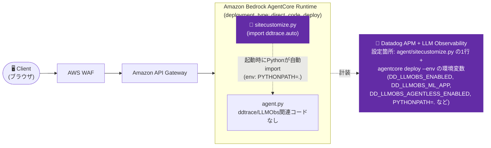

# Iteration 1 (LLMObs env-only variant): `agent.py` に一切手を加えずに ddtrace/LLM Observability を有効化する

`agent.py`に`ddtrace`/`LLMObs`関連のコードを一切追加せず、`direct_code_deploy`のAgentCoreエージェントでDatadog APM + LLM Observabilityを有効化できるかを検証したバリアント。

## Overview

- 実証するDatadog機能: APM + LLM/Agent Observability(アプリコード変更なし、環境変数+`sitecustomize.py`のみ)
- 技術スタック: Amazon Bedrock AgentCore Runtime(`deployment_type: direct_code_deploy`)上のLangGraphエージェント(Python)

これは [iteration-1](../iteration-1/)(Browser → Amazon API Gateway → Amazon Bedrock AgentCore Runtime、OAuthパススルー)のコピーで、次の問いに答えるために作成した検証用ディレクトリです: **`agent.py` に `ddtrace`/`LLMObs` 関連のコードを一切追加せずに、AgentCoreのエージェントプロセスでDatadog APM + LLM Observabilityを有効化できるか?**

iteration-1本体の実際にデプロイ済みのエージェント(`agent_1`)には一切手を加えていません — 別のエージェント名(`agent_1_llmobs_env`)を使っており、両者は共存できます。**実際にデプロイしてエンドツーエンドで動作確認済みです**(詳細は「Verify in Datadog」を参照)。

**結論**: **できます。** このディレクトリの `agent/agent.py` は、`import ddtrace` も `LLMObs.enable(...)` の呼び出しも一切ない、素のエージェントコードそのままです。有効化は次の2点のみで完結しています:

1. `agent.py` の隣に置いた `sitecustomize.py`(1行だけ: `import ddtrace.auto`)
2. 追加の環境変数 `PYTHONPATH=.` + 通常の `DD_*` 系設定変数 — コード変更もDockerfileも不要

## Architecture



`agent/agent.py` そのものにはDatadog関連の変更が一切なく、Datadogの設定は上図で強調した2箇所(`sitecustomize.py`というファイルの追加、`agentcore deploy`時の環境変数)だけで完結します。

## Datadog設定

- 有効化している機能: APM + LLM/Agent Observability(エージェント側のみ。RUM/Lambdaはこの検証の対象外)
- 関連ファイル:
  - `agent/sitecustomize.py` — 追加した唯一の新規ファイル。中身は1行だけ: `import ddtrace.auto  # noqa: F401`。`ddtrace.auto` は `ddtrace-run` と全く同じブートストラップ処理(`ddtrace/bootstrap/sitecustomize.py` → `ddtrace/bootstrap/preload.py`)を実行し、`DD_LLMOBS_ENABLED=1` が設定されていればLLMObsの「product」(`ddtrace/llmobs/_product.py`)も自動起動します — APMトレーシングだけに限定された仕組みではありません。
  - `agent/agent.py` — 変更なし(素のエージェントコード)
- 必要な環境変数 / APIキー(旧`LLMObs.enable(...)`のkwargsの置き換え):
  ```bash
  agentcore deploy \
    --env "DD_API_KEY=${DD_API_KEY}" \
    --env "DD_SITE=datadoghq.com" \
    --env "DD_ENV=sandbox" \
    --env "DD_SERVICE=agentcore-iteration-1-llmobs-env-agent" \
    --env "DD_LLMOBS_ENABLED=1" \
    --env "DD_LLMOBS_ML_APP=agentcore-iteration-1-llmobs-env-agent" \
    --env "DD_LLMOBS_AGENTLESS_ENABLED=1" \
    --env "DD_TRACE_LANGCHAIN_ENABLED=false" \
    --env "PYTHONPATH=." \
    --env 'DD_TRACE_SAMPLING_RULES=[{"resource": "GET /ping", "sample_rate": 0}]'
  ```
  `PYTHONPATH=.` — `entryPoint` は相対パス `agent.py` であり、マネージドランタイムの起動時cwdはコードのルートディレクトリなので、`.` はそのディレクトリを指し、`sitecustomize.py` がimport可能になります。

  旧コードベースの呼び出しとの対応:

  | `LLMObs.enable(...)` のkwarg | 対応する環境変数 |
  |---|---|
  | `ml_app=...` | `DD_LLMOBS_ML_APP` |
  | `api_key=...` | `DD_API_KEY` |
  | `site=...` | `DD_SITE` |
  | `agentless_enabled=True` | `DD_LLMOBS_AGENTLESS_ENABLED=1` |
  | *(呼び出し自体)* | `DD_LLMOBS_ENABLED=1` + `sitecustomize.py`(`import ddtrace.auto`) + `PYTHONPATH=.` |

  `DD_TRACE_LANGCHAIN_ENABLED=false` は依然として必須です — iteration-1と同じ `ddtrace`+LangGraphのクラッシュ回避策です(ルートREADMEの「既知の問題・落とし穴」参照)。`DD_TRACE_SAMPLING_RULES` はAgentCore自身の `GET /ping` ヘルスチェックのノイズをAPMから除外するもので、こちらもiteration-1と同様です。

## Prerequisites

[iteration-1](../iteration-1/README.md)と同じ(共有 `agentcore-cognito` スタック、テストユーザー) — 手順はそちらのREADMEを参照してください。

## Setup / How to Run

[iteration-1](../iteration-1/README.md)と同じ構成(共有Cognitoスタック、OAuthパススルー、API Gateway + WAF)に従いますが、以下が異なります:

1. **エージェントの設定・デプロイ** — iteration-1と同じ `agentcore configure` フロー(`direct_code_deploy`、`PYTHON_3_11`、同じCognitoプールを指すOAuth authorizer)ですが、既にデプロイ済みの `agent_1` と衝突しないよう、別名の `agent_1_llmobs_env` を使用します。`agent/sitecustomize.py` はソースディレクトリ内の単なる1ファイルなので、特別な手順なしで自動的にパッケージングされます。
2. **デプロイ**: 上記の環境変数を指定して `agentcore deploy` を実行するだけ — Dockerfileの編集もentryPointの上書きも不要です。
3. **API Gateway + フロントエンド**: iteration-1と同一 — 新しいエージェントのRuntime IDで `api-gateway.yaml` をデプロイし、`frontend/index.html` の `CONFIG` を更新します。`frontend/index.html` のRUM計装は本検証では変更・未使用です(エージェントプロセス側のみが検証対象)。(今回の検証では未デプロイ — 検証は `agentcore invoke` でRuntimeに直接Cognito JWTを渡す形で行い、メカニズムの確認には十分でした。)
4. **テスト**: エージェントを呼び出します(`agentcore invoke --bearer-token <cognitoのIDトークン>` またはフロントエンド経由)。

## Verify in Datadog

共有サンドボックスアカウント/リージョン(us-west-2、iteration-1と同じ共有Cognitoスタック)に `agent_1_llmobs_env` をデプロイし、上記の環境変数を渡した上で、実際のCognito JWTを使って呼び出しました(`agentcore invoke --bearer-token ...`):

- **CloudWatchログ**: 呼び出し時のログに `ddtrace/llmobs/_integrations/langgraph.py` が実際にLangGraph呼び出しを計装していることを示す出力(そのddtraceファイルの内部から発生した `LangChainDeprecationWarning` は、LangChainの `BaseChatModel` へのpatchが実際に効いている証拠)。`agent.py` は一度も `ddtrace` をimportしていないにもかかわらず、です。
- **Datadog APM**: `agentcore-iteration-1-llmobs-env-agent` サービス名でAPM Trace Explorerを検索すると、呼び出しの完全なトレースが `service:agentcore-iteration-1-llmobs-env-agent`、`env:sandbox`、`ingestion_reason:auto` のタグ付きで着弾していることを確認できます。`starlette.request` のルートスパン(`POST /invocations`)に加え、`langgraph.graph.state.CompiledStateGraph.LangGraph` → `RunnableSeq.call_model` → `RunnableSeq.tools` → `RunnableSeq.call_model` というLLM Observabilityのスパン群があり、`llmobs_trace_id`/`llmobs_parent_id` によってAPMトレースとLLM Observabilityスパンが相関付けられていることも確認済みです。

理論上の話ではなく、実際にエンドツーエンドで動作することを確認済みです。

## Cleanup

```bash
aws cloudformation delete-stack --stack-name agentcore-api   # このために API Gateway をデプロイした場合
cd agent && agentcore destroy
# 他のイテレーションが使っている共有Cognitoスタックは削除しないこと
```

## Notes

**有望に見えたが機能しなかった2つのアプローチ**: このイテレーションは(iteration-1のREADMEにある通り)`deployment_type: direct_code_deploy` を使っています — AgentCoreがソースコードをzipして、マネージドランタイム上でそのまま直接実行する方式で、**Dockerfile/コンテナは一切関与しません**。そのため、以下2つのアイデアはいずれも機能せず、最終的にsitecustomize方式に落ち着きました:

1. **コンテナのDockerfileの`CMD`に`ddtrace-run`を前置する。** これは `deployment_type: container` のときにしか適用できません。`direct_code_deploy` の場合、ツールキットは `entryPoint` 配列(例: `["agent.py"]`、AWS自身のOTel Observabilityが有効な場合は `["opentelemetry-instrument", "agent.py"]`)を組み立てて、それを `CreateAgentRuntime`/`UpdateAgentRuntime` APIの `agentRuntimeArtifact.codeConfiguration.entryPoint` フィールドに直接渡します — 編集対象のDockerfileがそもそも存在しません。(`deployment_type: container` では実際にこの方法が機能することを別途確認済みです — この方法だけを検証した [`../iteration-1-container-ddtrace-run/`](../iteration-1-container-ddtrace-run/) を参照してください。)
2. **`agentcore` CLIを経由せず、`UpdateAgentRuntime` APIを直接呼んで `entryPoint: ["ddtrace-run", "agent.py"]` を設定する。** このフィールドは単純なAPIパラメータなので、`["opentelemetry-instrument", "agent.py"]`(こちらは受理されることを確認済み)と同様に通ると思われました。しかし実際には通らず、`ddtrace-run`以外のラッパーはすべて `ValidationException: Invalid entrypoint value...` で拒否されます。つまり `entryPoint` の先頭トークンは任意の実行ファイルではなく、許可リスト方式のようです。実際にデプロイ済みの `agent_1_llmobs_env` ランタイムに対してboto3で直接テストして確認しました。

**実際に機能した方法の技術的背景**: CPythonの `site` モジュールは、インタプリタ起動時に `sys.path` 上で見つかった `sitecustomize` という名前のモジュールを自動importしますが、これは `PYTHONPATH`/`site-packages` 経由で到達可能な場合のみで、**スクリプト自身のディレクトリに置いただけでは自動import されません**(実際に検証: `PYTHONPATH` を設定せずに `python script.py` として実行した場合、スクリプトと同じディレクトリの `sitecustomize.py` は一度もimportされない。同じファイルでも `PYTHONPATH=.` を設定した場合はimportされる)。

**留意点**:
- ここで取り除いたのは*LLMObs/ddtraceの有効化呼び出し*だけです。LangChain/LangGraphや`botocore`がどのように計装されるかはiteration-1と変わらず、`ddtrace`の自動patchingがそのまま効いています。トリガーが明示的な `LLMObs.enable()` 呼び出しではなく `ddtrace.auto`(`sitecustomize.py`経由)になっただけです。
- `direct_code_deploy` のプロセス起動時のcwdがコードのルートディレクトリであることに依存しています(そのおかげで `PYTHONPATH=.` が正しく解決される)。これは現行のAgentCoreマネージドランタイムで観測された挙動であり、ドキュメント化された仕様ではありません。AWSが `direct_code_deploy` プロセスの起動方法を変更した場合は再確認が必要です。
- `entryPoint` の許可リスト的な挙動(ラッパーとして `opentelemetry-instrument` のみ受理される)も、ドキュメント化されていないAPIの観測された挙動です。将来これが変わり `entryPoint` 経由の `ddtrace-run` が使えるようになる可能性もあるため、記録として残しています。
