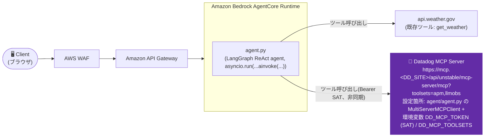

# Iteration 1 (Datadog MCP variant): AgentCoreエージェントからDatadog MCP ServerをSAT認証で利用する

これは [iteration-1](../iteration-1/) をベースに、**エージェントがDatadogを「観測される側」としてだけでなく、Datadog MCP Server経由で「使う側」(ツール呼び出し先)にもする**構成を追加した検証用ディレクトリです。これまでのイテレーションはすべて「エージェントをDatadogで計装する」話でしたが、このディレクトリは「エージェント自身がDatadogのAPMトレースやLLM Observabilityのデータなどをリアルタイムに照会できるようにする」話です。専用のエージェント名(`agent_1_mcp_datadog`)を使用し、`iteration-1`本体のデプロイ済みエージェントには一切影響しません。**実際にデプロイし、Datadog MCP経由の実データ照会までエンドツーエンドで動作確認済みです**(詳細は「Verify in Datadog」参照)。

## Overview

- 実証するDatadog機能: Datadog MCP Server(Model Context Protocol)への接続、Service Account Token(SAT)によるBearer認証
- 技術スタック: Amazon Bedrock AgentCore Runtime上のLangGraphエージェント(Python)、[`langchain-mcp-adapters`](https://pypi.org/project/langchain-mcp-adapters/)によるMCPクライアント、Amazon API Gateway、AWS WAF、Amazon Cognito(OAuth、iteration-1と同じ)
- 既存のAPM + LLM Observability計装(`ddtrace` + `LLMObs.enable(...)`)はiteration-1のまま維持しています — このバリアントはそれに加えて、エージェントの**ツールとして**Datadog MCPを追加するものです。

## Architecture



## Datadog設定

- 有効化している機能: Datadog MCP Server接続(エージェントのツールとして)。あわせて、iteration-1から引き継いだAPM + LLM Observability(`ddtrace`)も有効。
- 関連ファイル:
  - `agent/agent.py` — `_load_datadog_mcp_tools()` が `langchain_mcp_adapters.client.MultiServerMCPClient` でDatadog MCP Serverに接続し、取得したツールを既存のローカルツール(`get_current_time`、`get_weather`)と一緒にLangGraphエージェントへ渡します。エントリーポイントは`get_agent().invoke(...)`ではなく`asyncio.run(get_agent().ainvoke(...))`を使用(理由は下記「実際にハマった落とし穴」参照)。
  - `agent/requirements.txt` — `langchain-mcp-adapters` を追加。
- 接続先エンドポイント: `https://mcp.<DD_SITE>/api/unstable/mcp-server/mcp?toolsets=<DD_MCP_TOOLSETS>`(`DD_SITE`が`datadoghq.com`なら`https://mcp.datadoghq.com/...`。実際に`curl`でこのURLへの未認証アクセスが`401 Unauthorized`を返すことを確認済みで、エンドポイント自体は実在します)。
- 認証方式: **Service Account Token(SAT)**を`Authorization: Bearer <SAT>`ヘッダーで送信。Datadogの通常のAPIキー/アプリケーションキー(`DD_API_KEY`/`DD_APPLICATION_KEY`)ではこのエンドポイントは認証できません(`Authorization: Bearer`にAPIキーを入れて試したところ`401`)。SATはサービスアカウント単位で発行する専用のトークンです。
- 必要な環境変数 / APIキー(`agentcore deploy`実行時):
  ```bash
  agentcore deploy \
    --env "DD_API_KEY=${DD_API_KEY}" \
    --env "DD_SITE=datadoghq.com" \
    --env "DD_LLMOBS_ML_APP_NAME=agentcore-iteration-1-mcp-datadog-agent" \
    --env "DD_ENV=sandbox" \
    --env "DD_SERVICE=agentcore-iteration-1-mcp-datadog-agent" \
    --env "DD_TRACE_LANGCHAIN_ENABLED=false" \
    --env "DD_MCP_TOKEN=${DD_MCP_TOKEN}" \
    --env "DD_MCP_TOOLSETS=apm,llmobs"
  ```
  | 環境変数 | 用途 |
  |---|---|
  | `DD_MCP_TOKEN` | Datadog Service Account Token(SAT)。MCP ServerへのBearer認証に使用 |
  | `DD_MCP_TOOLSETS` | 公開するtoolsetの範囲。省略時は`apm,llmobs`(55ツール、実際にこの組み合わせで動作確認済み)。**`all`は指定しないこと**(理由は下記) |
  | `DD_SITE` | MCP ServerのURL(`https://mcp.<DD_SITE>/...`)の組み立てにも使用(既存のDatadog計装と共通) |

  `DD_MCP_TOKEN`が未設定の場合、エージェントはDatadog MCPのツールなしで(既存のローカルツールのみで)動作します — 設定を段階的に試せるようにするためのフォールバックです。

### SAT(Service Account Token)の作成方法

1. Datadogの **Organization Settings → Service Accounts** で対象のサービスアカウントを開く(なければ新規作成)
2. Access Tokensセクションの **+ New Token** をクリック
3. トークン名・有効期限(1日/1ヶ月/1年/なし/カスタム)を設定
4. **スコープを必要最小限に絞って**選択(このエージェントに使わせたいtoolsetに対応する権限のみ)
5. 保存し、表示されたトークン文字列を安全な場所に控える(再表示不可)

サービスアカウント自身への`service_account_write`権限、または組織全体に対する`org_app_keys_write`権限が必要です。詳細は[Service Access Tokensのドキュメント](https://docs.datadoghq.com/account_management/service-access-tokens/)を参照してください。

## Prerequisites

iteration-1と同じ共有 `agentcore-cognito` スタックとテストユーザー — 手順は[iteration-1](../iteration-1/README.md)のREADMEを参照してください。加えて:

- 上記の手順で発行したDatadog SAT(`DD_MCP_TOKEN`)

## Setup / How to Run

1. **前提条件**: iteration-1と同じ(共有 `agentcore-cognito` スタック、テストユーザー)。
2. **エージェントの設定・デプロイ** — iteration-1と同じ `agentcore configure` フロー(`direct_code_deploy`、`PYTHON_3_11`、同じCognitoプールを指すOAuth authorizer)ですが、既にデプロイ済みの `agent_1` と衝突しないよう、別名の `agent_1_mcp_datadog` を使用します。
3. **デプロイ**: 上記のDatadog設定セクションの環境変数を指定して `agentcore deploy` を実行します。
4. **API Gateway + フロントエンド**: iteration-1と同一 — 新しいエージェントのRuntime IDで `api-gateway.yaml` をデプロイし、`frontend/index.html` の `CONFIG` を更新します。(今回の検証では未デプロイ — `agentcore invoke`でRuntimeに直接Cognito JWTを渡す形で動作確認しました。)
5. **テスト**: エージェントを呼び出します(`agentcore invoke --bearer-token <cognitoのIDトークン>` またはフロントエンド経由)。例: `{"prompt": "Use your Datadog tools to search for any APM traces with errors in the last hour"}`。

## Verify in Datadog

`agent_1_mcp_datadog`(us-west-2、iteration-1と同じ共有Cognitoスタック、`DD_MCP_TOOLSETS=apm,llmobs`)を実際にデプロイし、Cognito JWTで呼び出して確認しました:

- **実データ照会の成功** — `"Use your Datadog tools to search for any APM traces with errors in the last hour. Just tell me how many you find and list one service name."` というプロンプトに対し、エージェントがDatadog MCP経由で`search_datadog_spans`相当のツールを呼び出し、実際にDatadogに存在するエラースパンの件数とサービス名を回答として返すことを確認しました。
- **APMトレース** — `service:agentcore-iteration-1-mcp-datadog-agent`で検索すると、成功した呼び出しの`POST /invocations`ルートスパイン配下に`langgraph.graph.state.CompiledStateGraph.LangGraph` → `RunnableSeq.call_model` → `RunnableSeq.tools`(Datadog MCPツール呼び出しに対応)→ `RunnableSeq.call_model` というスパン構造が記録され、ステータスは`ok`/`200`であることを確認済みです。
- **認証エラーの見分け方** — `DD_MCP_TOKEN`が無効な場合、CloudWatchログに`ExceptionGroup`にラップされた`httpx.HTTPStatusError: Client error '401 Unauthorized' for url 'https://mcp.<DD_SITE>/api/unstable/mcp-server/mcp?toolsets=...'`が出力されます(ダミートークンで実際に確認済み)。この場合エージェントはDatadog MCPのツールなしで動作を続けます。

## Cleanup

```bash
aws cloudformation delete-stack --stack-name agentcore-api   # このために API Gateway をデプロイした場合
cd agent && agentcore destroy
# 他のイテレーションが使っている共有Cognitoスタックは削除しないこと
```

## Notes

### 実際にハマった落とし穴(実機デプロイで発見・修正済み)

このバリアントは机上のコードレビューだけでは気づけない、実際にDatadog MCPへ接続して初めて表面化した問題が2つありました:

1. **`?toolsets=all`は362個のツールを返し、プロンプトが上限を超えてクラッシュする**: `toolsets=all`で接続すると実際に362個のツールが取得できます(SAT認証自体は成功)。しかし、これら全ツールの定義(JSON Schema)をモデルへのプロンプトに含めると236,793トークンになり、Bedrockの`ValidationException: prompt is too long: 236793 tokens > 200000 maximum`で最初の呼び出しから失敗します。`apm,llmobs`(55ツール)に絞ることで解決しました。これは単なるセキュリティ/最小権限の推奨事項ではなく、`all`のままでは**機能として動かない**という実測結果です。
2. **一部のMCPツールのJSON Schemaに`properties`キーが存在せず、ツール一覧の取得自体はできてもLLM Observabilityの計装がクラッシュする**: `_dd_gff`、`_dd_guc`、`_dd_rfw`、`do_not_call_refresh_widget`、`get_active_feature_flags`、`get_user_config`など、引数を取らない一部の内部系ツールは、JSON Schemaに`properties`キーがありません。`langchain_core.tools.base.BaseTool.args`はこのキーが常に存在する前提で実装されており(`json_schema["properties"]`)、`KeyError: 'properties'`を送出します。これは`ddtrace`のLangGraph統合(`create_react_agent()`時にツール一覧を読み取ってLLM Observabilityのマニフェストを作る処理)からも呼ばれるため、**エージェントの初期化自体が毎回クラッシュ**していました。`agent.py`の`_load_datadog_mcp_tools()`で、`.args`アクセスが`KeyError`になるツールを事前にフィルタして除外することで解決しました。
3. **`langchain-mcp-adapters`のMCPツールは非同期(`_arun`)のみ実装しており、同期呼び出しができない**: `bedrock_agentcore`のエントリーポイントは元々`get_agent().invoke(...)`という同期呼び出しでしたが、LangGraphの`ToolNode`が同期実行パスでMCPツールを呼ぼうとすると`NotImplementedError: StructuredTool does not support sync invocation`で失敗します(ローカルツールである`get_current_time`/`get_weather`は同期実装なので問題なく動きます)。`asyncio.run(get_agent().ainvoke(...))`に変更することで解決しました。

### その他の留意点

- **フォールバック動作**: `_load_datadog_mcp_tools()`は`DD_MCP_TOKEN`が未設定の場合、例外を投げずに空リストを返します。これは「まずMCP連携なしでエージェントの基本動作を確認し、その後SATを設定してMCPツールを有効化する」という段階的な検証をしやすくするための挙動です。ただし認証エラー(トークンが設定されているが無効)の場合は`asyncio.run(_load_datadog_mcp_tools())`が例外を伝播させ、`get_agent()`の初期化自体が失敗します — 「未設定」と「無効なトークン」は挙動が異なる点に注意してください。
- **接続はツール呼び出しごとに再確立されます**: `langchain-mcp-adapters`の`MultiServerMCPClient.get_tools()`は「A new session will be created for each tool call」という仕様です(ライブラリのdocstringより)。つまりエージェント起動時に一度`get_tools()`でツール一覧を取得した後、実際のツール呼び出し(HTTPリクエスト)はLangGraphがそのツールを実行するたびに新しいMCPセッションを張り直します。ロングランのMCPセッションを維持する設計ではありません。
- **`toolsets`のセキュリティ上の注意**: `all`は前述の通り機能面でも使えませんが、絞り込んだ場合でもSAT自体のスコープと`DD_MCP_TOOLSETS`の両方を、エージェントに実際に必要な範囲まで絞り込むことを推奨します(最小権限の原則)。
- このディレクトリは`iteration-1`のOAuthパススルー構成をベースにしていますが、Datadog MCP接続の仕組み自体は`iteration-2`/`iteration-3`(IAM認証、Lambda経由)の構成にも同様に追加できます。
