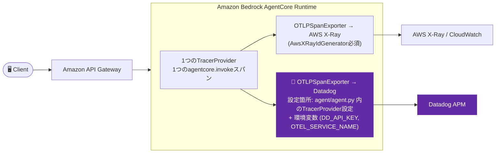

# Iteration 1(OTel版): OpenTelemetry経由でAWS CloudWatch/X-Rayと*同時に*Datadogへもdual-ship

Datadogネイティブの`ddtrace`ライブラリの代わりに、OpenTelemetry経由でAWS CloudWatch/X-RayとDatadogの両方に同じトレースを送れるかを検証した版。

## Overview

- 実証するDatadog機能: OTLP直接取り込みによるAPM(コレクタ/Agent不要)
- 技術スタック: Amazon Bedrock AgentCore Runtime上のLangGraphエージェント(Python)、OpenTelemetry SDK、AWS X-Ray直接OTLPエンドポイント

これは [iteration-1](../iteration-1/)(Browser → Amazon API Gateway → Amazon Bedrock AgentCore Runtime、OAuthパススルー)のコピーで、次の具体的な問いに答えるために作成しました: **Bedrock AgentCoreのエージェントは、Datadogネイティブの`ddtrace`ライブラリの代わりにOpenTelemetryを使って、同じトレースデータをAWS CloudWatch/X-RayとDatadogの両方に送れるか?**

`iteration-1`本体の実際にデプロイ済みのエージェント(`agent_1`)には一切手を加えていません — 別のエージェント名(`agent_1_otel`)を使っており、両者は共存できます。

**結論(先に要点)**: **できますが、「AgentCoreが既に動かしている何かに、Datadogを2番目の送信先として追加する」形にはなりません。** 拡張できる既存のin-process OpenTelemetryパイプラインは存在しません(詳細は「Notes」参照)。実際に機能する方法は、アプリケーション自身がOpenTelemetry SDKのセットアップを持ち、単一の`TracerProvider`から**コレクタを介さない独立した2つの直接OTLPエンドポイント**(AWS X-Ray向けとDatadog向け)へfan-outすることです。

## Architecture



## Datadog設定

- 有効化している機能: OTLP直接取り込みによるAPM(`ddtrace`は使わない)
- 関連ファイル: `agent/agent.py` — 1つの`TracerProvider`に2つの`BatchSpanProcessor`(AWS X-Ray向け、Datadog向け)を設定し、エージェント呼び出し全体を1つのスパン(`agentcore.invoke`)でラップ
- 必要な環境変数 / APIキー(`agentcore deploy`実行時):
  ```bash
  agentcore deploy \
    --env "DD_API_KEY=${DD_API_KEY}" \
    --env "DD_ENV=sandbox" \
    --env "OTEL_SERVICE_NAME=agentcore-iteration-1-otel-agent"
  ```
- エージェントの依存関係(`agent/requirements.txt`): 通常の `bedrock-agentcore`/`langchain`/`langgraph` に加えて `opentelemetry-api`、`opentelemetry-sdk`、`opentelemetry-exporter-otlp-proto-http`、`opentelemetry-sdk-extension-aws`、`botocore`、`requests`。
- 送信先とエンドポイント:

  | 送信先 | エンドポイント | 認証 |
  |---|---|---|
  | AWS X-Ray | `https://xray.<region>.amazonaws.com/v1/traces` | SigV4署名付きリクエスト(`xray:PutTraceSegments` + `xray:PutTelemetryRecords` のIAM権限が必要 — エージェントのデフォルト実行ロールに既に付与済み) |
  | Datadog | `https://otlp.datadoghq.com/v1/traces` | `dd-api-key` ヘッダー、署名不要 |

- 見落とすと静かに壊れる落とし穴:
  - **`AwsXRayIdGenerator()` が`TracerProvider`の`id_generator`として必須**です。X-RayはトレースIDの先頭4バイトがUnixタイムスタンプをエンコードしていることを要求します。このジェネレータがないと、トレースはエラーなく受理されますが、X-Ray/CloudWatchには一切表示されません。
  - **OTLPエクスポータの`session=`kwargは`requests.Session`オブジェクトを期待しており**、認証用のcallableではありません。カスタムのSigV4署名オブジェクトを直接`session=`として渡すと `AttributeError: 'SigV4Session' object has no attribute 'headers'` になります。代わりに実際の `requests.Session()` を作成し、その `.auth` にSigV4のcallableを設定してください。
  - アカウントのX-Rayトレースセグメントの送信先が `CloudWatchLogs` になっている必要があります(`aws xray get-trace-segment-destination` で確認 — 過去に`agentcore deploy`を実行していれば、AgentCore自身のObservabilityセットアップによって通常は既に`ACTIVE`になっています)。

## Prerequisites

[iteration-1](../iteration-1/README.md)と同じ(共有 `agentcore-cognito` スタック、テストユーザー) — 手順はそちらのREADMEを参照してください。

## Setup / How to Run

[iteration-1](../iteration-1/README.md)と同じデプロイ構成(共有Cognitoスタック、OAuthパススルー、API Gateway + WAF)に従いますが、以下が異なります:

1. **エージェントの設定・デプロイ** — iteration-1と同じ `agentcore configure`/`agentcore deploy` フローですが、既にデプロイ済みの `agent_1` と衝突しないよう別名(例: `agent_1_otel`)を使用します。Datadog APIキーとサービス名は上記の環境変数で渡します。
2. **API Gateway + フロントエンド**: iteration-1と同一 — 新しいエージェントのRuntime IDで `api-gateway.yaml` をデプロイし、`frontend/index.html` の `CONFIG` を更新します。
3. **テスト**: エージェントを呼び出します(`agentcore invoke` またはフロントエンド経由)。

## Verify in Datadog

エージェントを呼び出した後、同じtrace_idを両方の場所で検索できるはずです:

```bash
# Datadog(MCPまたはUI経由) - service:<あなたのOTEL_SERVICE_NAME> で検索
# タグ ingestion_reason:otel を確認し、ddtraceではなく直接OTLP経由で来たことを確認

# AWS X-Ray - トレースIDのフォーマットが異なる(ダッシュが挿入される)、例:
# Datadogのtrace_id 6a8686f717b8f5fb0d237fc174c1830d ==
# X-RayのトレースID    1-6a8686f7-17b8f5fb0d237fc174c1830d
aws xray get-trace-summaries --region <region> \
  --start-time $(date -u -v-15M +%s) --end-time $(date -u +%s)
aws xray batch-get-traces --trace-ids <the-matching-id> --region <region>
```

エンドツーエンドで確認済みです: `agentcore.invoke` スパン(コード内で設定したカスタム属性`agentcore.prompt_length`/`agentcore.response_length`付き)が、DatadogとX-Rayの両方に、まったく同じトレースIDで出現しました。

## Cleanup

```bash
aws cloudformation delete-stack --stack-name agentcore-api   # このために API Gateway をデプロイした場合
cd agent && agentcore destroy
# 他のイテレーションが使っている共有Cognitoスタックは削除しないこと
```

## Notes

**AgentCore自身のOTelセットアップを調査してわかったこと**: `agentcore deploy` は常にRuntime上に一連の `OTEL_*` 環境変数(`OTEL_PYTHON_DISTRO=aws_distro`、`OTEL_PYTHON_CONFIGURATOR=aws_configurator`、`x-aws-log-group`/`x-aws-log-stream`付きの`OTEL_EXPORTER_OTLP_TRACES_HEADERS`、`OTEL_RESOURCE_ATTRIBUTES`、`OTEL_PYTHON_EXCLUDED_URLS=/ping`)を自動設定し、`agentcore deploy` 実行のたびに "Traces delivery enabled" とログが出ます — 実際にGenAI Observability Dashboard/X-Rayにデータが表示されます。ここから、OpenTelemetryの自動計装がPythonプロセス内で動いていると考えるのは合理的です。**しかし実際には動いていません。**

実行中のエージェントプロセスを3つの時点(他のどのimportよりも前、`BedrockAgentCoreApp()` を構築した直後、実際の呼び出し時のリクエストハンドラ内)で、`opentelemetry.trace.get_tracer_provider()` の内容をダンプして調査しました。**どの時点でも、SDKのデフォルトである `ProxyTracerProvider`(no-opのプレースホルダー)のままで**、実際に設定された`TracerProvider`ではありませんでした。また、実行中のエージェント内から `http://localhost:4318/v1/traces`(OTel SDKのデフォルトのローカルOTLP/HTTP受信アドレス)へPOSTを試みましたが — `ConnectionRefused` でした。

**結論:** AgentCore自身のCloudWatch/X-Rayテレメトリを生成しているものは何であれ、それは完全に顧客のPythonプロセスの外側、AWSプラットフォーム/インフラ層で行われています。アプリケーションコードが2番目(Datadog向け)のエクスポータを追加できるような、共有された`TracerProvider`やローカルコレクタは存在しません。

**実運用でこのパターンを使う前に押さえておくべき注意点**:
- これは独自に書いたアプリケーションコードであり、AgentCoreやDatadogのドキュメント化された/サポート対象の機能ではありません — 動作を妨げるものは何もありませんが、AWSがAgentCore内部のテレメトリの仕組みを変更した場合に動作し続けることをベンダーが保証するものではありません。
- iteration 0-3で使っている`ddtrace`ベースのDatadog計装とは無関係で、干渉もしません — 両方が同じエージェントプロセスに存在した場合、2つは別々の連携しないトレーシングパイプラインになります(本検証では試していません。干渉を避けるため、意図的にクリーンなコピーから始めています)。
- DatadogのOTLP直接取り込みは、CollectorやAgentを動かせないこの種のサーバーレス/マネージドプラットフォームのシナリオのために用意されたものです。本番ワークロード全般については、メタデータの拡充や集中サンプリングのためにCollector/Agentを経由することをDatadogは推奨しています(それが選択肢になる場合)。ここ(AgentCore Runtimeのサンドボックス内)では選択肢になりません。
