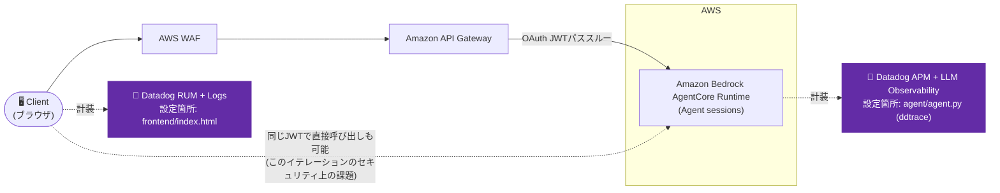

# Iteration 1: Amazon API Gateway + Amazon Bedrock AgentCore Runtime(OAuthパススルー)

Amazon Bedrock AgentCore Runtimeの前段に、Amazon Cognito認証とAWS WAF保護付きのAmazon API Gatewayを配置する構成。

## Overview

- 実証するDatadog機能: RUM + Logs(フロントエンド)、APM + LLM/Agent Observability(エージェント)
- 技術スタック: Amazon Bedrock AgentCore Runtime上のLangGraphエージェント(Python)、Amazon API Gateway、AWS WAF、Amazon Cognito(OAuth)

**主要な概念**:
- **OAuthトークンのパススルー**: 同じAmazon Cognito JWTがAmazon API GatewayとAmazon Bedrock AgentCoreの両方で検証される
- **AWS WAFによる保護**: IPごとのレート制限
- **セキュリティ上の注記**: ユーザーのJWTはAPIとエージェントの両方に直接使える — 修正方法はIteration 2を参照

## Architecture



## Datadog設定

- 有効化している機能: RUM + Logs(フロントエンド)、APM + LLM/Agent Observability(エージェント)。iteration-0と同じパターンです。
- 関連ファイル:
  - `frontend/index.html` — Datadog Browser SDKのRUM/Logs初期化スニペット。RUM application名は `agentcore-sample-iteration-1`。
  - `agent/agent.py` — 最初のimportとして `ddtrace.llmobs.LLMObs.enable(...)` を呼び出し
- 必要な環境変数 / APIキー(エージェントの `agentcore deploy` 実行時に渡す):
  ```bash
  agentcore deploy \
    --env "DD_API_KEY=${DD_API_KEY}" \
    --env "DD_SITE=datadoghq.com" \
    --env "DD_LLMOBS_ML_APP_NAME=agentcore-iteration-1-agent" \
    --env "DD_ENV=sandbox" \
    --env "DD_SERVICE=agentcore-iteration-1-agent" \
    --env "DD_TRACE_LANGCHAIN_ENABLED=false" \
    --env 'DD_TRACE_SAMPLING_RULES=[{"resource": "GET /ping", "sample_rate": 0}]'
  ```
  `DD_TRACE_LANGCHAIN_ENABLED=false` は必須です — ルートREADMEの「既知の問題・落とし穴」内の [dd-trace-py#18561](https://github.com/DataDog/dd-trace-py/issues/18561) を参照してください。`DD_TRACE_SAMPLING_RULES` はAgentCore自身の `GET /ping` ヘルスチェックのノイズをAPMから除外します。このイテレーションにはLambdaがないため、プロセス間のトレース伝播は不要です。
- 汎用的な手順(RUM appの作成、`agent.py` の正確なコードスニペットなど)については、ルートの [README.md → Datadogセットアップ手順](../README.md#datadog-setup-steps) を参照してください。
- 関連する別の版:
  - [`../iteration-1-otel/`](../iteration-1-otel/) — AgentCore自身のAWSネイティブなOTelパイプラインを、ここで使っている`ddtrace`の*代わりに*Datadogへdual-shipできるかを調査した版
  - [`../iteration-1-llmobs-env/`](../iteration-1-llmobs-env/)(`sitecustomize.py`方式)、[`../iteration-1-container-ddtrace-run/`](../iteration-1-container-ddtrace-run/)(Dockerfile方式) — `agent.py`に一切ddtrace/LLMObsのコードを書かずに済ませる方式の検証

## Prerequisites

**Amazon Cognitoを先にデプロイしておく必要があります**(iteration-0から):

```bash
cd ../iteration-0
aws cloudformation deploy \
  --template-file cognito.yaml \
  --stack-name agentcore-cognito \
  --capabilities CAPABILITY_NAMED_IAM \
  --region us-east-1
```

> **注記**: iteration-0で既にAmazon Cognitoをデプロイ済みの場合はこの手順をスキップしてください。

まだテストユーザーを作成していない場合:
```bash
USER_POOL_ID=$(aws cloudformation describe-stacks \
  --stack-name agentcore-cognito \
  --query 'Stacks[0].Outputs[?OutputKey==`UserPoolId`].OutputValue' \
  --output text)

aws cognito-idp admin-create-user \
  --user-pool-id $USER_POOL_ID \
  --username <YOUR_USERNAME_HERE> \
  --temporary-password <YOUR_TEMP_PASSWORD_HERE> \
  --message-action SUPPRESS

aws cognito-idp admin-set-user-password \
  --user-pool-id $USER_POOL_ID \
  --username <YOUR_USERNAME_HERE> \
  --password <YOUR_PASSWORD_HERE> \
  --permanent
```

> **パスワード要件**: 8文字以上で、大文字・小文字・数字・特殊文字を含む必要があります。

## Setup / How to Run

### 1. Amazon Cognitoの出力値を取得

```bash
CLIENT_ID=$(aws cloudformation describe-stacks \
  --stack-name agentcore-cognito \
  --query 'Stacks[0].Outputs[?OutputKey==`UserPoolClientId`].OutputValue' \
  --output text)

DISCOVERY_URL=$(aws cloudformation describe-stacks \
  --stack-name agentcore-cognito \
  --query 'Stacks[0].Outputs[?OutputKey==`OAuthDiscoveryUrl`].OutputValue' \
  --output text)

echo "Client ID: $CLIENT_ID"
echo "Discovery URL: $DISCOVERY_URL"
```

### 2. OAuth付きでエージェントをデプロイ

```bash
cd agent
agentcore configure
```
設定時のプロンプトでは以下を入力します:
- **Entrypoint**: `agent.py`
- **Agent name**: `agent_1`(またはEnterでデフォルト)
- **Requirements file**: Enterで検出された`requirements.txt`を使用
- **Deployment type**: `1`(Direct Code Deploy)
- **Python runtime**: `2`(PYTHON_3_11)
- **Execution role**: Enterで自動作成
- **S3 bucket**: Enterで自動作成
- **Configure OAuth authorizer?**: `yes`
- **OAuth discovery URL**: 手順1の `$DISCOVERY_URL` を使用
- **Allowed OAuth client IDs**: 空欄(Enter)
- **Allowed OAuth audience**: 手順1の `$CLIENT_ID` を入力
- **Allowed OAuth scopes**: 空欄(Enter)
- **Custom claims**: 空欄(Enter)
- **Request header allowlist**: `no`
- **Memory**: `s`(スキップ)

続けて実行します:

```bash
agentcore deploy
```

出力からRuntime IDを控えておいてください。

> **重要**: 次の手順では(完全なARNではなく)Runtime IDが必要です。`agent_1-AbCdEf123` のような形式です(ARNの `runtime/` の後の部分)。

### 3. Amazon API Gatewayをデプロイ

```bash
aws cloudformation deploy \
  --template-file api-gateway.yaml \
  --stack-name agentcore-api \
  --parameter-overrides \
    AgentRuntimeId=<YOUR_AGENT_RUNTIME_ID>  \
    CognitoStackName=agentcore-cognito \
  --capabilities CAPABILITY_IAM \
  --region us-east-1
```

> **⚠️ よくあるエラー**: Runtime IDのみを使用してください(例: `agent_1-AbCdEf123`)。完全なARNではありません。完全なARNを使うと404 "UnknownOperationException" エラーになります。

Amazon API Gatewayのエンドポイントを取得します:
```bash
API_ENDPOINT=$(aws cloudformation describe-stacks \
  --stack-name agentcore-api \
  --query 'Stacks[0].Outputs[?OutputKey==`ApiEndpoint`].OutputValue' \
  --output text)
echo "API Endpoint: $API_ENDPOINT"
```

### 4. フロントエンド設定を更新

`frontend/index.html` を編集し、CONFIGセクションを更新します:

```javascript
const CONFIG = {
  cognitoDomain: 'apigw-agentcore-<YOUR_ACCOUNT_ID>.auth.<YOUR_REGION>.amazoncognito.com',
  clientId: '<YOUR_CLIENT_ID>',
  redirectUri: 'http://localhost:8000',
  apiEndpoint: 'https://<YOUR_API_ID>.execute-api.<YOUR_REGION>.amazonaws.com/prod'
};
```

> **Tip**: これらの値はすべてプログラムから取得できます:
> ```bash
> # Cognitoドメイン(https://を除く)
> aws cloudformation describe-stacks --stack-name agentcore-cognito \
>   --query 'Stacks[0].Outputs[?OutputKey==`CognitoDomain`].OutputValue' --output text
>
> # Client ID
> aws cloudformation describe-stacks --stack-name agentcore-cognito \
>   --query 'Stacks[0].Outputs[?OutputKey==`UserPoolClientId`].OutputValue' --output text
> ```

### 5. テスト

```bash
cd frontend
python3 -m http.server 8000
```

http://localhost:8000 を開き、`<YOUR_USERNAME_HERE>` / `<YOUR_PASSWORD_HERE>` でログインします

> **トラブルシューティング**:
> - **404 "UnknownOperationException"**: Amazon API Gatewayのデプロイ時に完全なARNを使ってしまっています。スタックを削除し、IDのみで再デプロイしてください。
> - **401 Unauthorized**: トークンが期限切れまたは無効です。ログアウトして再度ログインしてみてください。
> - **CORSエラー**: `http://localhost:8000`(`127.0.0.1`ではない)を使用していることを確認してください。

## Verify in Datadog

- **RUM** — RUM Application `agentcore-sample-iteration-1` のSessions画面で、ログイン〜チャット操作のセッションを確認します。
- **APM + LLM Observability** — APM Trace Explorerで `service:agentcore-iteration-1-agent` を検索し、`POST /invocations` のトレースとLangGraphのLLM呼び出しスパンを確認します。

## Cleanup

```bash
aws cloudformation delete-stack --stack-name agentcore-api
cd agent && agentcore destroy
# 他のイテレーションで使っている場合はAmazon Cognitoを削除しないこと
```

## Notes

プロジェクト構成:
```
iteration-1/
├── README.md
├── api-gateway.yaml         # Amazon API Gateway + AWS WAF CloudFormationテンプレート
├── agent/
│   ├── agent.py             # LangGraphエージェント
│   └── requirements.txt
└── frontend/
    └── index.html           # 単一ページのチャットUI
```
