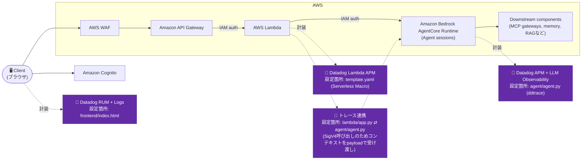

# Iteration 2: Amazon API Gateway → AWS Lambda → Amazon Bedrock AgentCore(IAM認証)

Amazon API GatewayとAmazon Bedrock AgentCore Runtimeの間に薄いAWS Lambda層を追加し、LambdaがIAMでエージェントを呼び出すことでAPI層の迂回を防ぐ構成。

## Overview

- 実証するDatadog機能: RUM + Logs(フロントエンド)、Lambda APM(Serverless Macro)、APM + LLM/Agent Observability(エージェント)、Lambda → エージェント間のトレース連携
- 技術スタック: Amazon Bedrock AgentCore Runtime上のLangGraphエージェント(Python)、AWS Lambda、Amazon API Gateway、AWS WAF、Amazon Cognito

**このイテレーションでの変更点**: Iteration 1には目立たないセキュリティ上のギャップがあります: ユーザーが受け取るJWTは、Amazon API Gatewayとエージェントランタイム自体の両方で直接使えてしまいます。悪意のあるユーザーがエージェントのエンドポイントを何らかの方法で知っていれば、APIを迂回してエージェントを直接呼び出すことができてしまいます。

Iteration 2はこれを次の方法で修正します:
- **AWS Lambda層**: リクエスト処理・ログ出力・将来の拡張のためのコンピュートを追加
- **エージェント側のIAM認証**: エージェントはOAuthではなくIAMを使用 — ユーザーは直接呼び出せない
- **Amazon API Gateway側のAmazon Cognito**: JWT検証はAmazon API Gatewayレベルのみで行う

## Architecture



## Datadog設定

- 有効化している機能: RUM + Logs(フロントエンド)、Lambda APM(`ChatFunction`)、APM + LLM/Agent Observability(エージェント)、Lambda → エージェント呼び出しを越えたトレース連携
- 関連ファイル:
  - `frontend/index.html` — RUM application `agentcore-sample-iteration-2` の初期化スニペット
  - `agent/agent.py` — `ddtrace.llmobs.LLMObs.enable(...)` を最初のimportとして呼び出し
  - `template.yaml` — `Transform` に追加した [Datadog Serverless Macro](https://docs.datadoghq.com/serverless/libraries_integrations/macro/)
  - `lambda/services/agent_service.py`(実体は`lambda/app.py`/そのサービスモジュール) ⇄ `agent/agent.py` — トレースコンテキストの手動inject/extract
- 必要な環境変数 / APIキー:
  - エージェント(`agentcore deploy`実行時):
    ```bash
    agentcore deploy \
      --env "DD_API_KEY=${DD_API_KEY}" \
      --env "DD_SITE=datadoghq.com" \
      --env "DD_LLMOBS_ML_APP_NAME=agentcore-iteration-2-agent" \
      --env "DD_ENV=sandbox" \
      --env "DD_SERVICE=agentcore-iteration-2-agent" \
      --env "DD_TRACE_LANGCHAIN_ENABLED=false" \
      --env "DD_TRACE_PROPAGATION_STYLE=datadog,tracecontext" \
      --env 'DD_TRACE_SAMPLING_RULES=[{"resource": "GET /ping", "sample_rate": 0}]'
    ```
  - Lambda(`sam deploy`実行時): `--parameter-overrides ... "DatadogApiKey=${DD_API_KEY}"`
- Lambda → エージェント呼び出しを越えたトレース連携: `lambda/services/agent_service.py` が、現在のDatadogトレースコンテキストを `invoke_agent_runtime` のペイロードに `_datadog_trace_headers` としてinjectします。`agent/agent.py` はそれをextractし、LangGraphエージェントを呼び出す前に本物の子スパン(`tracer.start_span(child_of=..., activate=True)`)を開きます(コンテキストがない場合は `contextlib.nullcontext()` でラップ)。LambdaのAWSトレース(`aws.lambda`スパン)とエージェントの`agentcore.invoke`スパンが同一trace_idの下に着弾することを確認済みです。
- 汎用的な手順と完全なコードスニペットについては、ルートの [README.md → Datadogセットアップ手順](../README.md#datadog-setup-steps) を参照してください。

## Prerequisites

**Amazon CognitoとIAMロールを先にデプロイしておく必要があります**(iteration-0から):

```bash
cd ../iteration-0
aws cloudformation deploy \
  --template-file cognito.yaml \
  --stack-name agentcore-cognito \
  --capabilities CAPABILITY_NAMED_IAM \
  --region us-east-1
```

> **注記**: 前のイテレーションで既にAmazon Cognitoをデプロイ済みの場合はこの手順をスキップしてください。

実行ロールのARNを取得します:
```bash
EXECUTION_ROLE_ARN=$(aws cloudformation describe-stacks \
  --stack-name agentcore-cognito \
  --query 'Stacks[0].Outputs[?OutputKey==`AgentCoreExecutionRoleArn`].OutputValue' \
  --output text)
echo "Execution Role ARN: $EXECUTION_ROLE_ARN"
```

> **このARNを保存してください** — エージェントの設定時に必要になります。

また以下も必要です:
- インストール済みのAWS SAM CLI([インストールガイド](https://docs.aws.amazon.com/serverless-application-model/latest/developerguide/install-sam-cli.html))
- 作成済みのテストユーザー(iteration-0のREADMEを参照)

## Setup / How to Run

### 1. IAM認証付きでエージェントをデプロイ

```bash
cd agent
agentcore configure
```

設定時のプロンプトでは以下を入力します:
- **Entrypoint**: `agent.py`
- **Agent name**: `agent_2`(またはEnterでデフォルト)
- **Requirements file**: Enterで検出された`requirements.txt`を使用
- **Deployment type**: `1`(Direct Code Deploy)
- **Python runtime**: `2`(PYTHON_3_11)
- **Execution role**: 前提条件で取得した `$EXECUTION_ROLE_ARN` を貼り付け
- **S3 bucket**: Enterで自動作成
- **Configure OAuth authorizer?**: `no`(iteration-2ではIAM認証を使用)
- **Request header allowlist**: `no`
- **Memory**: `s`(スキップ — iteration-2ではMemoryは使わない)

> **重要**: Iteration-2はIAM認証を使用します(OAuthではありません)。AWS LambdaがそのIAMロールを使ってエージェントを呼び出すため、ユーザーはAPIを迂回してエージェントを直接呼び出すことができません。

続けてデプロイします:
```bash
agentcore deploy
```

出力からAgent ARNを控えておいてください。

### 2. Amazon CognitoのARNを取得

```bash
COGNITO_ARN=$(aws cloudformation describe-stacks \
  --stack-name agentcore-cognito \
  --query 'Stacks[0].Outputs[?OutputKey==`UserPoolArn`].OutputValue' \
  --output text)
echo "Cognito ARN: $COGNITO_ARN"
```

### 3. AWS Lambda + Amazon API Gatewayをデプロイ

iteration-2のディレクトリから:

```bash
cd ..  # iteration-2のルートへ戻る(まだagent/にいる場合)

# ビルドしてデプロイ
sam build
sam deploy --parameter-overrides \
  "AgentCoreRuntimeArn=arn:aws:bedrock-agentcore:<YOUR_REGION>:<YOUR_ACCOUNT_ID>:runtime/<YOUR_AGENT_RUNTIME_ID>" \
  "CognitoUserPoolArn=arn:aws:cognito-idp:<YOUR_REGION>:<YOUR_ACCOUNT_ID>:userpool/<YOUR_USER_POOL_ID>"
```

> **Tip**: タイプミスを避けるため、完全なAgent ARNは `agentcore deploy` の出力から直接コピーしてください。

> **ROLLBACK_COMPLETEでデプロイが失敗する場合**: スタックが失敗状態になっています。まず削除してください:
> ```bash
> aws cloudformation delete-stack --stack-name iteration2
> # 削除完了を待ってから sam deploy を再実行
> ```

出力からAmazon API Gatewayのエンドポイントを取得します:
```bash
API_ENDPOINT=$(aws cloudformation describe-stacks \
  --stack-name iteration2 \
  --query 'Stacks[0].Outputs[?OutputKey==`ApiEndpoint`].OutputValue' \
  --output text)
echo "API Endpoint: $API_ENDPOINT"
```

### 4. フロントエンド設定を更新

`frontend/index.html` を編集し、CONFIGセクションに値を設定します。

> **すべての値を素早く取得する方法**:
> ```bash
> # Cognitoドメイン(使用時はhttps://プレフィックスを除く)
> aws cloudformation describe-stacks --stack-name agentcore-cognito \
>   --query 'Stacks[0].Outputs[?OutputKey==`CognitoDomain`].OutputValue' --output text
>
> # Client ID
> aws cloudformation describe-stacks --stack-name agentcore-cognito \
>   --query 'Stacks[0].Outputs[?OutputKey==`UserPoolClientId`].OutputValue' --output text
>
> # API Endpoint
> aws cloudformation describe-stacks --stack-name iteration2 \
>   --query 'Stacks[0].Outputs[?OutputKey==`ApiEndpoint`].OutputValue' --output text
> ```

### 5. テスト

```bash
cd frontend
python3 -m http.server 8000
```

http://localhost:8000 を開き、`<YOUR_USERNAME_HERE>` / `<YOUR_PASSWORD_HERE>` でログインします

> **トラブルシューティング**:
> - **500 Internal Server Error**: Amazon CloudWatchでAWS Lambdaのログを確認してください。よくある原因はIAM権限の不足です。
> - **401 Unauthorized**: トークンが期限切れです。ログアウトして再度ログインしてください。

## Verify in Datadog

- **RUM** — RUM Application `agentcore-sample-iteration-2` のSessions画面でフロントエンド操作を確認します。
- **Lambda APM** — APM Trace ExplorerでLambda(`ChatFunction`)のサービスのトレースを確認します。
- **エージェントのAPM + LLM Observability** — `service:agentcore-iteration-2-agent` で検索し、LangGraphのLLM呼び出しスパンを確認します。
- **トレース連携** — Lambdaの`aws.lambda`スパンからエージェントの`agentcore.invoke`スパンまでが同一trace_idの1本のトレースとして繋がっていることを確認します。

## Cleanup

```bash
sam delete --stack-name iteration2
cd agent && agentcore destroy
```

## Notes

プロジェクト構成:
```
iteration-2/
├── README.md
├── template.yaml            # AWS SAMテンプレート
├── samconfig.toml
├── agent/
│   ├── agent.py             # LangGraphエージェント(IAM認証)
│   └── requirements.txt
├── lambda/
│   ├── app.py               # AWS Lambdaハンドラ
│   └── requirements.txt
└── frontend/
    └── index.html           # 単一ページのチャットUI
```

構築時に遭遇した既知の落とし穴(詳細はルートREADMEを参照):
- `LLMObs.enable(...)` とLangGraphのツール呼び出しを組み合わせると、ddtraceのバグ([dd-trace-py#18561](https://github.com/DataDog/dd-trace-py/issues/18561))で実際のリクエストがクラッシュします — `DD_TRACE_LANGCHAIN_ENABLED=false` で修正(`DD_TRACE_LANGGRAPH_ENABLED` も一緒に無効化しては**いけません**。それはクラッシュを直さずトレース構造を壊してしまいます)。
- `tracer.context_provider.activate()` だけでは、エージェントのLangGraph実行にトレースコンテキストを伝播するのに不十分です — 本物の子スパン(`tracer.start_span(child_of=..., activate=True)`)が必要です。LangGraphのPregelランタイムは `concurrent.futures.ThreadPoolExecutor` でノードを実行し、ddtraceはスレッド間でアクティブなSpanしか伝播せず、素のContextは伝播しないためです。
- このアカウントで共有されているIAMの「アカウントあたりのロール数」クォータは、新しいLambda実行ロールをデプロイする際に到達することがあります — 混雑した/共有のAWSアカウントを使っている場合は、デプロイ前に `aws iam list-roles` の件数を確認してください。
