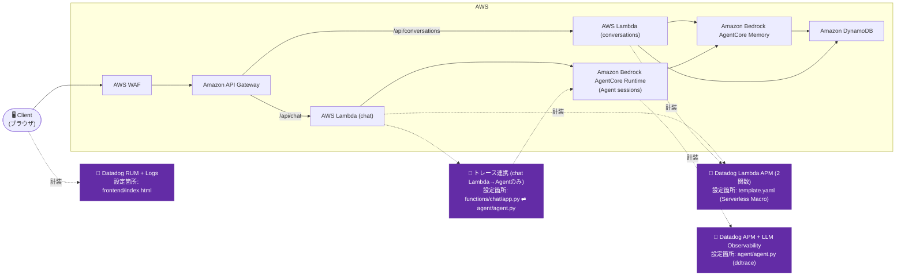

# Iteration 3: Amazon API Gateway + AWS Lambda + Amazon Bedrock AgentCore RuntimeでホストされるLangGraphエージェント + Amazon Bedrock AgentCore Memoryによる会話記憶

会話の永続化と会話名の自動生成を備えた、フル機能のチャットアプリケーション。

## Overview

- 実証するDatadog機能: RUM + Logs(フロントエンド)、Lambda APM(2関数、Serverless Macro)、APM + LLM/Agent Observability(エージェント)、chat Lambda → エージェント間のトレース連携
- 技術スタック: Amazon Bedrock AgentCore Runtime上のLangGraphエージェント(Python)、AWS Lambda(chat/conversations)、Amazon API Gateway、Amazon Bedrock AgentCore Memory、Amazon DynamoDB

**機能**:
- **Amazon Cognito認証**: Amazon API Gatewayレベルでのjwt検証
- **IAM認証**: AWS Lambda → Amazon Bedrock AgentCoreはIAMクレデンシャルを使用
- **会話の記憶**: メッセージはAmazon Bedrock AgentCore Memoryに保存
- **自動命名**: 最初のメッセージでエージェントが会話名を生成
- **Amazon DynamoDB**: 会話のメタデータ(名前、タイムスタンプ)を保存

## Architecture



## Datadog設定

このイテレーションには2つのLambdaがあり、エージェントを呼び出すのはそのうち1つだけです:

- 有効化している機能: RUM + Logs(フロントエンド)、両方のLambda(`ChatFunction`、`ConversationsFunction`)のLambda APM、APM + LLM/Agent Observability(エージェント)、chat Lambda → エージェント呼び出しのトレース連携
- 関連ファイル:
  - `frontend/index.html` — RUM application `agentcore-sample-iteration-3` の初期化スニペット
  - `agent/agent.py` — `ddtrace.llmobs.LLMObs.enable(...)` を最初のimportとして呼び出し
  - `template.yaml` — `Transform` にあるDatadog Serverless Macro。各関数の `Environment.Variables` に `DD_SERVICE` を直接設定(下記の落とし穴を参照)
  - `functions/chat/services/agent_service.py` ⇄ `agent/agent.py` — トレースコンテキストの手動inject/extract(`ChatFunction`のみ)
- 必要な環境変数 / APIキー:
  - エージェント(`agentcore deploy`実行時): iteration-2と同じ環境変数セット(`DD_LLMOBS_ML_APP_NAME`/`DD_SERVICE=agentcore-iteration-3-agent`、`DD_TRACE_LANGCHAIN_ENABLED=false`、`DD_TRACE_PROPAGATION_STYLE=datadog,tracecontext`、`/ping`除外用の`DD_TRACE_SAMPLING_RULES`)
  - Lambda(`sam deploy`実行時): `DatadogApiKey` パラメータ
- トレース連携は`ChatFunction`のみ: `invoke_agent_runtime` を呼ぶのはこの関数だけなので、`_datadog_trace_headers` をペイロードにinjectするのは`services/agent_service.py`のみ、それをextract/joinするのは`agent/agent.py`の`invoke()`のみです。`ConversationsFunction`はエージェントではなくAgentCore MemoryとDynamoDBに直接アクセスするため、連携すべきLangGraph実行側のピアが存在しません — Macroによる通常のLambda APMは受けますが、プロセス間のトレース連携はありません。
- 汎用的な手順と完全なコードスニペットについては、ルートの [README.md → Datadogセットアップ手順](../README.md#datadog-setup-steps) を参照してください。

## Prerequisites

- クレデンシャル付きで設定済みのAWS CLI
- インストール済みのSAM CLI([インストールガイド](https://docs.aws.amazon.com/serverless-application-model/latest/developerguide/install-sam-cli.html))
- Python 3.11以上(`python3 --version` で確認。必要なら `uv python install 3.11`)

**Amazon Cognitoを先にデプロイしておく必要があります**(iteration-0から):

```bash
cd ../iteration-0
aws cloudformation deploy \
  --template-file cognito.yaml \
  --stack-name agentcore-cognito \
  --capabilities CAPABILITY_NAMED_IAM \
  --region us-east-1
```

> **注記**: 前のイテレーションで既にAmazon Cognitoをデプロイ済みの場合はこの手順をスキップしてください。

また、テストユーザーの作成も必要です(iteration-0のREADMEを参照)。

## Setup / How to Run

### 1. 実行ロールのARNを取得

```bash
EXECUTION_ROLE_ARN=$(aws cloudformation describe-stacks \
  --stack-name agentcore-cognito \
  --query 'Stacks[0].Outputs[?OutputKey==`AgentCoreExecutionRoleArn`].OutputValue' \
  --output text)
echo "Execution Role ARN: $EXECUTION_ROLE_ARN"
```

> **このARNを保存してください** — エージェントの設定時に貼り付けます。

### 2. Memory付きでエージェントをデプロイ

```bash
cd agent
agentcore configure
```

設定時のプロンプトでは以下を入力します:
- **Entrypoint**: `agent.py`
- **Agent name**: `agent_3`(またはEnterでデフォルト)
- **Requirements file**: Enterで検出された`requirements.txt`を使用
- **Deployment type**: `1`(Direct Code Deploy)
- **Python runtime**: `2`(PYTHON_3_11)
- **Execution role**: 手順1で取得した `$EXECUTION_ROLE_ARN` を貼り付け
- **S3 bucket**: Enterで自動作成
- **Configure OAuth authorizer?**: `no`(IAM認証を使用 — LambdaがエージェントをIAMで呼び出す)
- **Request header allowlist**: `no`
- **Memory**: `c`(新規Memoryを作成)
  - **Memory name**: `iteration3-memory`(任意の名前でも可)

> **重要**: Iteration-3はIAM認証を使用します(OAuthではありません)。AWS LambdaはそのIAMロールを使ってエージェントを呼び出します。会話の永続化にはMemoryが必要です。

続けてデプロイします:
```bash
agentcore deploy
```

出力からAgent ARNとMemory IDを控えておいてください:
- Agent ARN: `arn:aws:bedrock-agentcore:us-east-1:ACCOUNT:runtime/AGENT_ID`
- Memory ID: `iteration3-memory-XXXXX`(サフィックスを含む完全なID)

> **⚠️ 重要**: Agent ARNとMemory IDの両方を保存してください — SAMデプロイ時に必要になります。

### 3. AWS Systems Managerパラメータを保存

エージェントは実行時にこれらを読み取り、MemoryとAmazon DynamoDBテーブルを見つけます:

```bash
# <YOUR_MEMORY_ID> は agentcore deploy の出力にあるMemory IDに置き換えてください
aws ssm put-parameter --name /agentcore/memory-id --value "<YOUR_MEMORY_ID>" --type String --overwrite
aws ssm put-parameter --name /dynamo/conversation-table --value "iteration3-conversations" --type String --overwrite
```

> **パラメータが作成されたことを確認**:
> ```bash
> aws ssm get-parameter --name /agentcore/memory-id --query 'Parameter.Value' --output text
> aws ssm get-parameter --name /dynamo/conversation-table --query 'Parameter.Value' --output text
> ```

### 4. AWS Lambda関数をビルド

```bash
cd ..  # iteration-3のルートへ戻る(まだagent/にいる場合)

# ビルド
sam build
```

### 5. AWS Lambda + Amazon API Gatewayをデプロイ

Amazon CognitoのARNを取得します:
```bash
COGNITO_ARN=$(aws cloudformation describe-stacks \
  --stack-name agentcore-cognito \
  --query 'Stacks[0].Outputs[?OutputKey==`UserPoolArn`].OutputValue' \
  --output text)
echo "Cognito ARN: $COGNITO_ARN"
```

デプロイ(プレースホルダーを手順2の値に置き換え):
```bash
sam deploy --parameter-overrides \
  "AgentCoreRuntimeArn=arn:aws:bedrock-agentcore:<YOUR_REGION>:<YOUR_ACCOUNT_ID>:runtime/<YOUR_AGENT_RUNTIME_ID>" \
  "AgentCoreMemoryId=<YOUR_MEMORY_ID>" \
  "CognitoUserPoolArn=arn:aws:cognito-idp:<YOUR_REGION>:<YOUR_ACCOUNT_ID>:userpool/<YOUR_USER_POOL_ID>" \
  --no-confirm-changeset
```

> **Tip**: フォーマットの問題を避けるため、Agent ARNとMemory IDは `agentcore deploy` の出力から直接コピーしてください。

> **ROLLBACK_COMPLETEでデプロイが失敗する場合**: スタックが失敗状態になっています。まず削除してください:
> ```bash
> aws cloudformation delete-stack --stack-name iteration3
> # 削除完了を待ってから sam deploy を再実行
> ```

出力からAmazon API Gatewayのエンドポイントを控えておいてください。

### 6. フロントエンド設定を更新

スタックからAmazon Cognitoの値を取得します:
```bash
# Cognitoドメインを取得
COGNITO_DOMAIN=$(aws cloudformation describe-stacks \
  --stack-name agentcore-cognito \
  --query 'Stacks[0].Outputs[?OutputKey==`CognitoDomain`].OutputValue' \
  --output text)
echo "Cognito Domain: $COGNITO_DOMAIN"

# Client IDを取得
CLIENT_ID=$(aws cloudformation describe-stacks \
  --stack-name agentcore-cognito \
  --query 'Stacks[0].Outputs[?OutputKey==`UserPoolClientId`].OutputValue' \
  --output text)
echo "Client ID: $CLIENT_ID"

# APIエンドポイントを取得(iteration3スタックから)
API_ENDPOINT=$(aws cloudformation describe-stacks \
  --stack-name iteration3 \
  --query 'Stacks[0].Outputs[?OutputKey==`ApiEndpoint`].OutputValue' \
  --output text)
echo "API Endpoint: $API_ENDPOINT"
```

`frontend/index.html` を編集し、CONFIGセクションにこれらの値を設定します:

```javascript
const CONFIG = {
  cognitoDomain: 'apigw-agentcore-<YOUR_ACCOUNT_ID>.auth.<YOUR_REGION>.amazoncognito.com',  // COGNITO_DOMAINから(https://を除く)
  clientId: '<YOUR_CLIENT_ID>',  // CLIENT_IDから
  redirectUri: 'http://localhost:8000',
  apiEndpoint: 'https://<YOUR_API_ID>.execute-api.<YOUR_REGION>.amazonaws.com/prod'  // API_ENDPOINTから
};
```

### 7. テスト

```bash
cd frontend
python3 -m http.server 8000
# http://localhost:8000 を開く
```

Amazon Cognitoのテストユーザーでログインし、メッセージを送信します。エージェントは以下を行います:
1. 最初のメッセージから会話名を生成
2. Amazon DynamoDBに保存
3. サイドバーに表示

> **トラブルシューティング**:
> - **サイドバーに会話が表示されない**: AWS Systems Managerパラメータが正しく設定されているか確認してください(手順3)。
> - **500エラー**: AWS Lambda関数のAmazon CloudWatch Logsを確認してください。よくある原因: AWS Systems Managerパラメータの不足、IAM権限の問題。
> - **最初のメッセージが遅い**: AWS Lambda + Amazon Bedrock AgentCoreのコールドスタートです。以降のメッセージは速くなります。
> - **"Unable to get weather"**: weather.gov APIは米国内の地点にのみ対応しています。米国の都市名で試してください。

## Verify in Datadog

- **RUM** — RUM Application `agentcore-sample-iteration-3` のSessions画面でフロントエンド操作を確認します。
- **Lambda APM** — APM Trace Explorerで`ChatFunction`と`ConversationsFunction`両方のサービスのトレースを確認します。
- **エージェントのAPM + LLM Observability** — `service:agentcore-iteration-3-agent` で検索し、LangGraphのLLM呼び出しスパンを確認します。
- **トレース連携** — `/api/chat` の呼び出しでは、`ChatFunction`の`aws.lambda`スパンからエージェントの`agentcore.invoke`スパンまでが同一trace_idの1本のトレースとして繋がっていることを確認します(`/api/conversations`側はこの連携がないことも仕様として確認)。

## Cleanup

```bash
# AWS Lambdaスタックを削除
sam delete --stack-name iteration3

# エージェントを削除
cd agent
agentcore destroy

# AWS Systems Managerパラメータを削除
aws ssm delete-parameter --name /agentcore/memory-id
aws ssm delete-parameter --name /dynamo/conversation-table
```

> **注記**: Amazon DynamoDBテーブルはAWS SAMスタックとともに自動的に削除されます。Amazon Bedrock AgentCore Memoryは`agentcore destroy`で削除されます。

## Notes

**構築時に遭遇した既知の落とし穴**: 1つのテンプレートに2つのLambdaがある場合特有の落とし穴として、各 `AWS::Serverless::Function` に `Metadata: {DatadogServerless: {service: ...}}` で関数ごとのDatadogサービス名を設定しても、実際には `DD_SERVICE` は設定されませんでした(`aws lambda get-function-configuration` で確認 — 変数が単純に存在していなかった)。代わりに各関数の `Environment.Variables` に `DD_SERVICE` を直接設定することで修正しました — `template.yaml` を参照してください。

**ファイル構成**:
```
iteration-3/
├── agent/                      # Amazon Bedrock AgentCore Runtimeエージェント
│   ├── agent.py               # 会話命名機能付きエージェント
│   └── requirements.txt
├── functions/
│   ├── chat/                  # Chat AWS Lambda
│   │   ├── app.py
│   │   ├── requirements.txt
│   │   └── services/
│   │       └── agent_service.py
│   └── conversations/         # Conversations AWS Lambda
│       ├── app.py
│       ├── requirements.txt
│       └── services/
│           └── conversation_service.py
├── frontend/
│   └── index.html
├── template.yaml              # AWS SAMテンプレート
└── samconfig.toml
```

**APIエンドポイント**:

| メソッド | パス | 説明 |
|--------|------|-------------|
| POST | /api/chat | エージェントへメッセージを送信 |
| GET | /api/conversations | 会話一覧を取得(Amazon DynamoDBから) |
| GET | /api/conversations/{session_id} | メッセージを取得(Amazon Bedrock AgentCore Memoryから) |

**データフロー**:

1. **チャット**: フロントエンド → Amazon API Gateway → Chat AWS Lambda → Amazon Bedrock AgentCore Runtime
   - エージェントが新規会話かどうかを判定し、名前を生成してAmazon DynamoDBに保存
   - エージェントがメモリのコンテキストを使ってメッセージを処理

2. **会話一覧の取得**: フロントエンド → Amazon API Gateway → Conversations AWS Lambda → Amazon DynamoDB
   - actor_idに紐づく会話名を返す

3. **メッセージの取得**: フロントエンド → Amazon API Gateway → Conversations AWS Lambda → Amazon Bedrock AgentCore Memory
   - session_id + actor_idに対応するメッセージ履歴を返す
